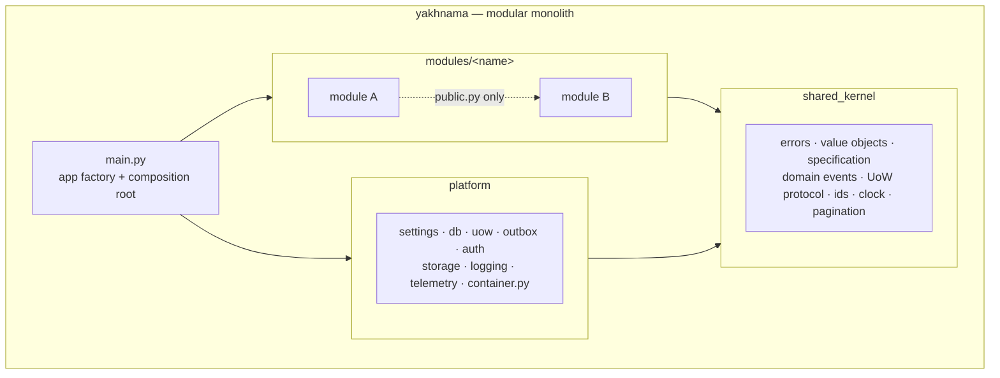
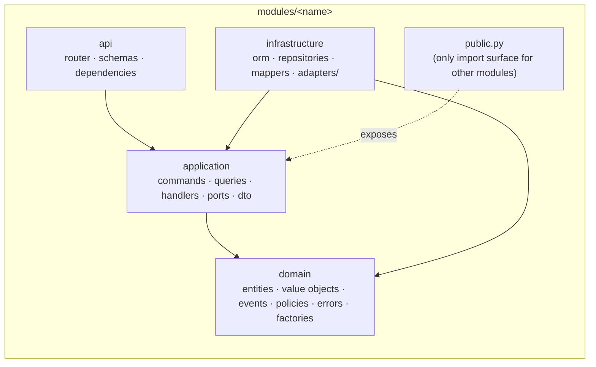

# Yakhnama

*Yakhnama, chronicle of the ice: `yakh` is Persian for ice, `nāma` a written record.*

[](https://github.com/khanakhun/yakhnama/actions/workflows/ci.yml)
[](pyproject.toml)
[](LICENSE)
[](https://github.com/astral-sh/ruff)
[](pyproject.toml)
[](https://www.conventionalcommits.org)
[](https://github.com/pre-commit/pre-commit)

## Mission

Gilgit-Baltistan and the wider high-mountain region hold, in the project brief that
motivated this work, more than 13,000 glaciers and thousands of glacial lakes — a count we
have not yet traced to a citable inventory; see `docs/open-questions.md`. The hazards that
come off them recur every year: glacial lake
outburst floods (GLOFs), landslides, debris flows, cloudbursts, flash floods, avalanches
and glacier surges. There is no complete, trustworthy public record of these events.

Yakhnama builds one. Community members submit reports of what they observed. Moderators
verify reports into canonical events, tying every fact to a source. The result is a
research-grade, openly licensed dataset that researchers, responders and residents can
actually trust.

## What this repository is

The Python backend and system of record: report intake, moderator verification, the
event and impact-claim data model, and the API and export formats that serve the
dataset.

## What this repository is not

A frontend, a mobile app, a machine-learning pipeline, or a live early-warning system.
Those live elsewhere and consume this backend's API and exports.

## Core principles

- **Reports are not events.** A report is one person's or organisation's observation,
  never trusted by default. An event only exists once a moderator verifies it.
- **Impact figures are claims.** Every casualty count, damage estimate or affected-area
  number is one source's claim with a confidence level, not a fact stated by the system.
- **Every fact carries provenance.** Nothing is asserted without a source record behind
  it.
- **Nothing verified is ever hard-deleted.** Corrections are new revisions; retraction is
  a status change with a reason, not a deletion.
- **Correctness over speed.** A wrong figure, a lost report or an untraceable number
  damages the only record this region has.

## Architecture at a glance

**Style:** modular monolith. Each bounded context lives under `src/yakhnama/modules/<name>/`
with hexagonal layers (`domain`, `application`, `infrastructure`, `api`) and talks to every
other module only through its `public.py` facade. No microservices, no mediator library.

| Layer | Owns |
|-------|------|
| `main.py` | App factory and composition root: routes, exception handlers, wiring |
| `shared_kernel/` | Framework-free building blocks: errors, value objects, specification, domain events, unit-of-work protocol, ids, clock, pagination |
| `platform/` | Cross-cutting infrastructure: settings, db, uow, outbox, auth, storage, logging, telemetry, `container.py` |
| `modules/<name>/domain/` | Entities, value objects, domain events, policies, errors, factories — no framework imports |
| `modules/<name>/application/` | Commands, queries, handlers, ports (`typing.Protocol`), DTOs |
| `modules/<name>/infrastructure/` | ORM mapping, repositories, mappers, adapters to external systems |
| `modules/<name>/api/` | FastAPI router, request/response schemas, dependencies |

The domain workflow named in `AGENTS.md`'s pattern catalog spans modules for reports,
events, hazards, verification, identity, ingestion and exchange formats; the full module
boundary list is recorded as it is decided, in `docs/adr/`.



Inside every module, dependencies point inward, hexagonal-style:



Writes and reads are handled separately (CQRS-lite): a write is a Pydantic command routed
to a handler that runs inside a unit of work and emits domain events; a read is a query
served by a query service that returns DTOs directly, bypassing the write model. Domain
errors all derive from `shared_kernel.errors.YakhnamaError` and are mapped to RFC 9457
Problem Details in one place: the exception handlers in `main.py`.

See `docs/architecture/README.md` for the full module map and `docs/adr/` for the
recorded decisions behind it.

## Quick start

Requirements: Python ≥ 3.13, [Poetry](https://python-poetry.org/) 2.x, Docker with
Compose v2. Get a 3.13 interpreter with `uv python install 3.13` (uv is used only to
download the interpreter, never to manage this project's dependencies), or with pyenv or
the deadsnakes PPA.

```bash
git clone https://github.com/khanakhun/yakhnama.git
cd yakhnama

poetry install
cp .env.example .env

poetry run poe up          # PostgreSQL 16 + PostGIS 3.5, MinIO, Keycloak 26, Redis 7
                            # (also creates the MinIO buckets via `minio-init`)
poetry run poe migrate     # apply Alembic migrations (from Phase 1)
poetry run poe seed        # load the versioned reference data idempotently (from Phase 1)
poetry run pre-commit install

poetry run poe check       # everything CI runs
```

If a default port is already taken on your machine, override it in `.env` before running
`poe up`: `POSTGRES_HOST_PORT`, `MINIO_HOST_PORT`, `MINIO_CONSOLE_HOST_PORT`,
`KEYCLOAK_HOST_PORT` and `REDIS_HOST_PORT`.

Run the API:

```bash
poetry run uvicorn yakhnama.main:create_app --factory --reload
```

- Liveness: `GET /health/live`
- Readiness (checks the database, from Phase 1): `GET /health/ready`
- OpenAPI document: `/api/v1/openapi.json`
- Swagger UI: `/api/v1/docs`

Stop the local services with `poetry run poe down`.

## Development workflow

All commands run through Poetry and Poe so they behave the same locally and in CI. Every
task below is defined in `pyproject.toml` under `[tool.poe.tasks]`.

| Command | What it does |
|---------|--------------|
| `poetry run poe format` | `ruff format` then `ruff check --fix` |
| `poetry run poe lint` | Format check and lint, no changes |
| `poetry run poe typecheck` | `mypy --strict` over `src`, `tests`, `.claude/hooks` |
| `poetry run poe arch` | `lint-imports` layer and module contracts |
| `poetry run poe test-unit` | Unit tests (no I/O) with coverage |
| `poetry run poe test-api` | HTTP-level tests against the app factory |
| `poetry run poe cov` | All non-integration tests with the coverage gate |
| `poetry run poe diff-cover` | Coverage ≥ 90 % on lines changed against `main` |
| `poetry run poe security` | `gitleaks` secret scan and `pip-audit` dependency audit |
| `poetry run poe up` / `down` | Start or stop PostGIS, MinIO, Keycloak, Redis |
| `poetry run poe docs` | Serve this documentation site locally (`mkdocs serve`) |
| `poetry run poe check` | Everything CI runs, in order — green here means green in CI |

`poetry run poe migrate` (Alembic) and `poetry run poe test-integration` (real PostGIS and
MinIO via testcontainers) are added once there is something to migrate or integrate
against, from Phase 1. `poetry run poe openapi-snapshot` is added with the first versioned
endpoint, from Phase 2.

Install the git hooks once with `poetry run pre-commit install`; they run `ruff format`,
`ruff check`, `mypy`, `lint-imports`, `gitleaks`, `poetry check --lock` and `commitizen`
(on the commit message) plus end-of-file and trailing-whitespace fixers on every commit.

Work proceeds in phases. Each `docs/plans/phase-N.md` is written and approved by the
maintainer before any code of that phase is written; see `docs/plans/` for the current
plan and `CONTRIBUTING.md` for the branch model.

## Project layout

```
src/yakhnama/
  main.py            app factory + composition root (routes, exception handlers, wiring)
  shared_kernel/      framework-free building blocks: errors, value objects, specification,
                       domain events, unit-of-work protocol, ids, clock, pagination
  platform/           cross-cutting infrastructure: settings, db, uow, outbox, auth, storage,
                       logging, telemetry, container.py (the only other composition root)
  modules/<name>/
    domain/           entities.py value_objects.py events.py policies.py errors.py factories.py
    application/      commands.py queries.py handlers.py ports.py dto.py
    infrastructure/   orm.py repositories.py mappers.py adapters/
    api/              router.py schemas.py dependencies.py
    public.py         the ONLY import surface for other modules
tests/  unit/ integration/ api/ contract/ architecture/ factories/ fakes/
docs/   adr/ architecture/ data-dictionary/ plans/
```

## Data standards

- Timestamps are UTC, timezone-aware, with a `DatePrecision` (`exact | hour | day | month
  | season | year`) stored alongside every date.
- Geometry is WGS84 (EPSG:4326).
- Measurements are stored in SI units, value plus unit.
- Identifiers are UUIDv7.
- Public exports are GeoJSON, CSV and GeoParquet (fixed by the project specification; the
  `exchange` module arrives in Phase 4), each shipped with a licence sidecar file naming the
  dataset's licence and attribution requirements.

## Status

**Phase 1: shared kernel and reference data** — in progress, per `docs/plans/phase-1.md`
(approved by the maintainer). The shared kernel, the database/outbox/telemetry platform,
and the `geography`, `hazards` and `impacts` modules (domain, application and
persistence layers) exist, with an Alembic migration environment and an idempotent
reference-data seed. No public endpoints beyond `/health/live` and `/health/ready` yet.

Roadmap:

- **Phase 0 — Foundation.** Poetry/Ruff/mypy/import-linter tooling, app factory, CI,
  docker-compose, agent infrastructure, community documents and ADRs. Complete.
- **Phase 1 — Shared kernel and reference data.** Framework-free building blocks,
  database and transaction infrastructure, and the `geography`, `hazards` and `impacts`
  reference-data modules with versioned YAML seed data. In progress.
Phases 2–4 are planned, each subject to an approved `docs/plans/phase-N.md`:

- **Phase 2 — API contract.** First versioned endpoints, an OpenAPI snapshot and contract
  tests against it.
- **Phase 3 — Core domain.** Scope defined in `docs/plans/phase-3.md` when it is written
  and approved; expected to build out reports, verification, events and impact claims.
- **Phase 4 — Data sources.** External source adapters and import/export formats; see
  `docs/architecture/data-sources.md`, added in this phase.

## Contributing

See `CONTRIBUTING.md` for setup, the branch model, Conventional Commits, the Definition
of Done and the review process.

## Security

See `SECURITY.md` to report a vulnerability. Personal-data exposure and reporter-safety
issues are in scope and prioritised.

## Code of conduct

This project follows the [Contributor Covenant](CODE_OF_CONDUCT.md) 2.1.

## Licence

Code is licensed under [Apache-2.0](LICENSE) (pending maintainer confirmation, see
ADR 0010).

<!-- maintainer decision pending -->
Data licence: proposed [CC BY 4.0](https://creativecommons.org/licenses/by/4.0/), pending
final maintainer confirmation — see `docs/open-questions.md`.

## Acknowledgements

Data providers (for example ICIMOD, GLIMS, OCHA-style humanitarian data sources) will be
listed here as they are integrated, from Phase 4 onward.
