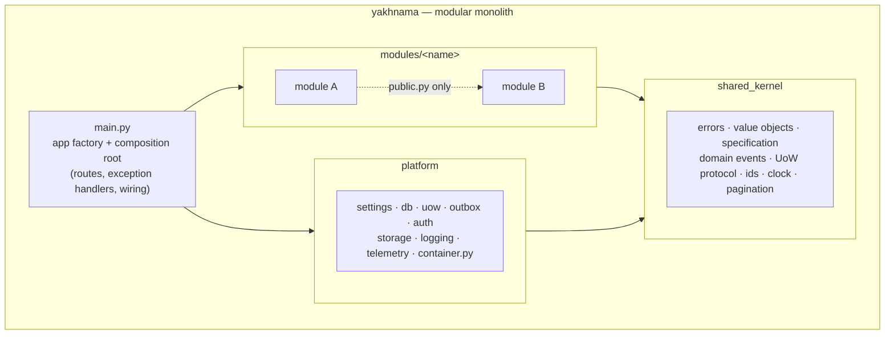
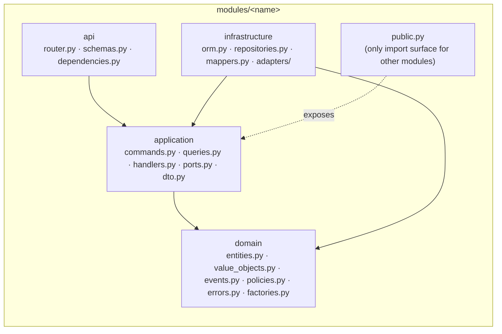
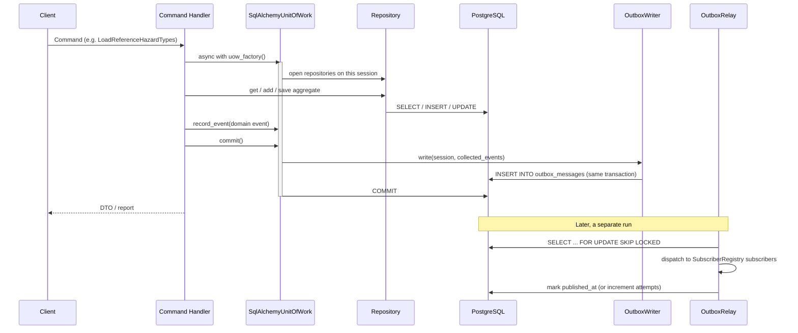

# Architecture

## Purpose

This page orients a new contributor or reviewer in the shape of the backend before they
read code: the modular-monolith boundary, the hexagonal layers inside each module, the
read/write flow, and where errors are handled. It condenses `AGENTS.md` §2–§3; where the
two disagree, `AGENTS.md` is binding.

## Modular monolith

Yakhnama is one deployable service, not microservices. Each bounded context is a module
under `src/yakhnama/modules/<name>/`. Modules never import each other's internals — only
the other module's `public.py` facade — so the boundaries that matter for a future split
are enforced today by `lint-imports`, not just convention.

`main.py` and `platform/container.py` are the only two composition roots: the only places
allowed to bind a port (a `typing.Protocol` in `application/ports.py`) to a concrete
adapter.

## Hexagonal layers, per module

Every module has the same four layers, and dependencies point only inward:

`domain` never imports FastAPI, SQLAlchemy, httpx, Shapely, boto, or anything in
`platform`/`infrastructure`; it depends only on the standard library, Pydantic,
`geojson-pydantic` and `shared_kernel`. This is enforced by the `import-linter` contracts
in `pyproject.toml` (`poetry run poe arch`).

## Module map

The concepts below come from the glossary in `AGENTS.md` §7. The pattern catalog in
`AGENTS.md` §3 names the following modules explicitly; additional bounded contexts (for
example dedicated modules for impact claims, sources or places, as opposed to their being
owned by `events`) are proposed and recorded as they are decided, in `docs/adr/`.

| Module | Owns (per the glossary) | Key rule |
|--------|--------------------------|----------|
| `reports` | Report intake and triage | A report is never trusted by default and never edited after submission; corrections are new revisions. Report triage checks use a Chain of Responsibility. |
| `events` | Event, Best figure | An event is the canonical record, created or merged by moderators through verification. Event creation from reports uses a Factory; the best figure is a documented aggregation policy over impact claims. |
| `hazards` | Hazard type | A node in the IRDR-aligned taxonomy with a stable code, retired but never reused or deleted. Hazard-specific attributes use a Strategy + Registry (discriminated unions). |
| `verification` | Verification case | The state-machine record attached to a report, event or claim; only a human moves it to `verified`. Modelled as an explicit State transition table. |
| `identity` | Authorisation | Authorisation rules are a composable, Specification-style Policy. |
| `ingestion` | External data intake | Ingestion pipelines use a Template Method; see "Phase 4 state" below for what exists. |
| `exchange` | Import/export formats | One Importer/Exporter per format (GeoJSON, CSV, GeoParquet, JSON), via Strategy + Registry; see "Phase 4 state" below for what exists. |

`shared_kernel` and `platform` are not bounded contexts; they are the framework-free
building blocks and the cross-cutting infrastructure every module depends on (see the
diagram above).

## Reads and writes (CQRS-lite)

- **Write:** a Pydantic `Command` → a `Handler` (`application/handlers.py`) → a `Unit of
  Work` → repositories → entities → domain events, written to the transactional
  `Outbox` in the same transaction and relayed to subscribers afterward.
- **Read:** a `Query` served by a `Query Service` behind a port, with optimised SQL in
  `infrastructure`, returning `DTO`s directly — it never goes through the write model or
  domain entities.

Handlers and query services are plain callables wired in the composition root
(`main.py`, `platform/container.py`), not a mediator library.

## Error mapping

All domain errors derive from `shared_kernel.errors.YakhnamaError`: `NotFoundError`,
`ConflictError`, `ValidationError`, `PermissionDeniedError`, `InvariantViolationError`,
`InvalidTransitionError`. They are mapped to
[RFC 9457](https://www.rfc-editor.org/rfc/rfc9457) Problem Details in exactly one place —
the exception handlers registered in `main.py` — so no module or layer below `api`
formats an HTTP response.

## Phase 1 state

Phase 1 (`docs/plans/phase-1.md`) added the shared kernel, the database and outbox
platform, and three reference-data modules with domain, application and persistence
layers. The module map above stays the description of every eventual bounded context;
this section records what actually exists after Phase 1.

### Module map (Phase 1)

| Module | Owns | Key rule | Status |
|--------|------|----------|--------|
| `geography` | `AdminLevel`, `Place` aggregate, `PlaceName` | A place is never deleted, only retired or merged; at most one preferred name per language (`src/yakhnama/modules/geography/domain/entities.py`, `docs/data-dictionary/geography.md`). | domain + application + persistence |
| `hazards` | `HazardType` taxonomy, hazard attribute schemas (Strategy + Registry), `GlacierRef`/`GlacialLakeRef` | A hazard type code is retired, never reused or deleted; attribute payloads validate against `DEFAULT_REGISTRY` (`src/yakhnama/modules/hazards/domain/`, `docs/data-dictionary/hazards.md`). | domain + application + persistence |
| `impacts` | `ImpactMetric` registry | `category`, `value_kind`, `unit`, `currency` and `aggregation` are immutable once a metric exists; a metric code is never reused (`src/yakhnama/modules/impacts/domain/entities.py`, `docs/data-dictionary/impacts.md`). | domain + application + persistence (registry only; claims arrive in Phase 3) |

Each module follows the layer rules in `AGENTS.md` §2.1 and exposes only `public.py` to
the other two and to `yakhnama.seed`; `pyproject.toml`'s `[tool.importlinter]` contracts
enforce this and the hexagonal layering inside each module.

### The seed flow

`poetry run poe seed` (`src/yakhnama/seed/__main__.py`) runs
`SeedReferenceDataHandler` (`src/yakhnama/seed/application.py`), which:

1. Checks a `SeedPolicy` (an allow-list placeholder until Phase 2's identity policies
   land) before touching anything.
2. Reads each versioned file in `data/reference/` through the `ReferenceFileReader`
   port, validating it against that module's reference-file model.
3. Hands each parsed file to its module's load command handler, in order — hazard
   types, then impact metrics, then places — because later records refer to hazard
   types and metrics by code.
4. Each module's loader runs in its own unit of work and is idempotent: it upserts by
   code, never deletes, and applies only labels, retirement status, names and
   centroids in place on a re-run, reporting anything else as skipped for a human
   (`docs/open-questions.md`, Q41–Q44).

The seed is therefore not one atomic transaction across modules; re-running it after a
partial failure completes the work without duplicating anything, because every
individual load is idempotent.

### Platform pieces added in Phase 1

- **`platform/container.py`** — the second composition root (`AGENTS.md` §2.1). Builds
  the database engine and session factory, binds `Clock` and `IdGenerator`, and
  constructs one `OutboxWriter`, one `SubscriberRegistry` and one `OutboxRelay` shared
  by the whole application.
- **`platform/uow.py`** — `SqlAlchemyUnitOfWork` implements the `UnitOfWork` protocol
  from `shared_kernel/uow.py`. A module subclasses it, overriding
  `_open_repositories` to build its SQLAlchemy repositories on the session the unit of
  work opened; `platform/container.py` binds a `SqlAlchemyUnitOfWorkFactory` per module
  to that module's `UnitOfWorkFactory` port. On `commit`, the unit of work stages the
  collected domain events as outbox rows in the same session before committing, so the
  aggregate write and its events are atomic (ADR 0007).
- **`platform/outbox/writer.py`** — serialises each `DomainEvent` into an
  `OutboxMessage` row and stages it with `session.add`; it never flushes or commits
  itself.
- **`platform/outbox/relay.py`** — `OutboxRelay.relay_once` claims pending rows with
  `SELECT ... FOR UPDATE SKIP LOCKED` (safe under concurrent relays), dispatches each
  to its `SubscriberRegistry` subscribers and marks it published only once every
  subscriber returns without raising — **at-least-once delivery**, so every subscriber
  must be idempotent, keyed by `OutboxEnvelope.event_id`. A failure increments
  `attempts` and stores only the error type in `last_error` (never the exception text
  or the payload, per `AGENTS.md` §5); after `max_attempts` (default 5) a message stops
  being claimed until a human or a future dead-letter process handles it
  (`docs/open-questions.md`, Q47).
- **`platform/telemetry.py`** — `configure_telemetry` instruments FastAPI and
  SQLAlchemy with OpenTelemetry when enabled. `PersonalDataSpanProcessor` strips query
  strings and redacts client address, port and user agent on every span as it starts;
  `PersonalDataSpanExporter` wraps every exporter so exception text (driver messages,
  stack traces) never leaves the process, keeping only the exception type and status
  code (`AGENTS.md` §5). The OTLP exporter is not installed yet
  (`docs/open-questions.md`, Q46).
- **`platform/health.py`** — `/health/live` checks nothing (a database outage must not
  make an orchestrator restart healthy processes); `/health/ready` runs `SELECT 1`
  against the engine within a configurable timeout and returns HTTP 503 when it fails.
  The object storage check joins in Phase 3, when the storage port exists.

### A write, end to end

## Phase 2 state

Phase 2 (`docs/plans/phase-2.md`) added the `identity` module, the platform HTTP
foundations every later endpoint relies on, and the first public read endpoints. This
section records what actually exists after Phase 2; `docs/architecture/api.md` is the
detailed companion for the API surface itself, and `docs/architecture/auth.md` for
authentication.

### Module map (Phase 2 addition)

| Module | Owns | Key rule | Status |
|--------|------|----------|--------|
| `identity` | `User`, `Organization`, `Membership`, `Role`, `Actor`, the authorisation policies | A user is mirrored from its OIDC token at first sight and never deleted; a suspended user keeps its roles but gets no `Actor`, so no policy allows it anything (`src/yakhnama/modules/identity/domain/`, `docs/data-dictionary/identity.md`). | domain + application + persistence + API |

The placeholder `AdminOnlyPolicy` duplicated in `geography`, `hazards` and `impacts`
(`docs/open-questions.md` Q41) is replaced by identity policies (`IsAdmin`,
`CanManageReferenceData`, ...) exposed through `modules/identity/public.py`, per the
Facade rule in `AGENTS.md` §2.1.

### Platform pieces added in Phase 2

- **`platform/auth/`** — `HttpJwksClient` (a TTL-cached, rate-limited-refetch JWKS
  client over `httpx`), `TokenValidator` (PyJWT-based signature and claim checks against
  the injected `Clock`), the `Principal` DTO, and `PrincipalResolutionMiddleware`, which
  validates the bearer token once per request and stores the outcome in request state for
  the rate limiter, the idempotency middleware and every route to read (ADR 0015; full
  detail in `docs/architecture/auth.md`, "The backend side").
- **`platform/idempotency/`** — the `IdempotencyStore` port, a PostgreSQL adapter
  (`idempotency_keys`, migration `0006_idempotency_keys`) and `IdempotencyMiddleware`,
  which replays the stored response of a repeated `Idempotency-Key` on an authenticated
  creating `POST` (ADR 0016).
- **`platform/etag.py`** — strong ETags (`"<id>:<version>"`) from an aggregate's
  `version`, and the `If-Match` checks that raise `PreconditionFailedError` (412) or
  `PreconditionRequiredError` (428).
- **`platform/ratelimit/`** — the `RateLimiter` port, an in-memory token-bucket adapter
  (development and tests) and a Redis fixed-window adapter (production, shared across
  processes), keyed per principal or per hashed client IP, with `RateLimitMiddleware`
  answering `429` Problem Details with `Retry-After` (ADR 0017).
- **`platform/http.py`** — the pure-ASGI hardening middlewares: request id, request
  logging (no personal data), security headers and CSP, `TrustedHostMiddleware`, CORS
  options, and `RequestBodyGuardMiddleware` (body size limit and NUL-character rejection).
- **`platform/api_docs.py`** — renders the self-hosted Scalar API reference page served at
  `/api/v1/docs` when `docs_enabled`, with a page-specific CSP computed from its own
  rendered HTML (ADR 0014); Swagger UI and ReDoc are never served.
- Extended error handling in `main.py`: `RequestValidationError` never echoes rejected
  input, 404/405 render as Problem Details, and the catch-all 500 handler adds the request
  id and security headers itself, because it runs outside every other middleware
  (Starlette's `ServerErrorMiddleware`).
- A production settings validator (`platform/settings.py`, `_guard_production` /
  `production_problems`) that refuses to start with unsafe production settings, collecting
  every broken rule into one message.

### Middleware order

`install_middlewares` (`main.py`) calls `add_middleware` innermost first (idempotency, body
guard, rate limit, principal resolution, CORS, trusted host, security headers, request
logging, request id, in that call order), so each new middleware wraps the ones already
added and the actual request-time order is the reverse — outermost first: request id,
request logging, security headers, trusted host, CORS, principal resolution, rate limit,
body guard, idempotency, then the routes (see `platform/http.py`'s module docstring for the
request-time explanation of each layer).

### The API layer conventions

Every route under `/api/v1` follows the same conventions for authentication, errors,
pagination, idempotency, concurrency and content negotiation. See
[`api.md`](api.md) for the full reference, including the route table with each route's
authentication and authorisation requirement.

## Phase 3 state

Phase 3 (`docs/plans/phase-3.md`) added the seven modules below (four domain
groups: provenance/audit, reports/media, events/verification, impacts extension),
the Taskiq task worker and scheduler, and the audit outbox subscriber. This
section records what actually exists after Phase 3;
[`recording.md`](recording.md) is the detailed companion for the end-to-end flow,
[`api.md`](api.md#phase-3-additions) for the route table, and
[`best-figure.md`](best-figure.md) for the impact aggregation policy.

### Module map (Phase 3 addition)

| Module | Owns | Key rule | Status |
|--------|------|----------|--------|
| `provenance` | `Source` (citizen, organisation, government, news, satellite, research, dataset) | Immutable once any fact cites it (`is_referenced`); a correction registers a new source (`docs/data-dictionary/provenance.md`). | domain + application + persistence + API |
| `audit` | `AuditEntry`, the append-only audit log | Ids, codes and SHA-256 digests only, never free text; written after commit by an outbox subscriber; no update or delete path (`docs/data-dictionary/audit.md`). | domain + application + persistence (no API; internal record) |
| `reports` | `Report`, revisions, triage | Never edited after submission; corrections are new revisions; triage (Chain of Responsibility) only suggests, never blocks or edits (`docs/data-dictionary/reports.md`). | domain + application + persistence + API |
| `media` | `MediaAsset`, the private original and the EXIF-stripped public copy | The original's EXIF, including location, is never published; publication needs a clean scan, an approval and no blocking sensitivity flag (`docs/data-dictionary/media.md`). | domain + application + persistence + API + adapters |
| `events` | `Event`, `EventRelation`, report links | The canonical record, created from reports by a Factory; public reads require both `published` and `verified` (`docs/data-dictionary/events.md`). | domain + application + persistence + API |
| `verification` | `VerificationCase` per report, event or claim | The §6.3 transition table; a reason is required except for `submitted`; only a human reaches `verified` (`docs/data-dictionary/verification.md`). | domain + application + persistence + API |
| `impacts` (extension) | `ImpactClaim`, `InfrastructureAsset`, `DamageRecord`, the best figure | Claims and damage are append-only; the best figure is a derived read model, never stored as a fact (`docs/data-dictionary/impacts.md`, `best-figure.md`). | domain + application + persistence + API |

### Platform pieces added in Phase 3

- **`platform/tasks/`** — the `TaskQueue` port (`shared_kernel`, ADR 0008) bound to a
  Taskiq adapter with a Redis broker in production and an in-memory fake in tests.
  `TaskHandlerRegistry` (Registry) maps each task name to the handler the
  composition root bound for it; `platform/tasks/scheduled.py` attaches Taskiq
  `schedule` labels for the periodic tasks, read by a `LabelScheduleSource`, so
  `poetry run poe scheduler` needs no storage of its own. `poetry run poe worker`
  runs the worker process that executes every task, periodic and one-off alike.
  See [`recording.md`](recording.md#task-names-and-schedules) for the task table.
- **`platform/storage/`** (adapters under `modules/media/infrastructure/adapters/`)
  — an `aiobotocore` S3-compatible client for presigned `PUT`/`GET`, private and
  public buckets, and SHA-256 verification on completion; see
  [`media.md`](media.md).
- **The audit outbox subscriber** — subscribes to every Phase 3 module's domain
  events (never its own, since `audit` emits none) and writes one `AuditEntry` per
  delivered event, keyed by `event_id` for at-least-once idempotency; see
  [`recording.md`](recording.md#audit-via-the-outbox-subscriber).
- **`shared_kernel/privacy.py`** — `PublicCoordinatePolicy` and
  `round_coordinates`, the one implementation every module shares to coarsen a
  reporter's position for a public payload, built from
  `Settings.public_coordinate_decimals`.
- **`shared_kernel` `SafeText`** — the shared free-text validation (Unicode NFC,
  no control characters, lone surrogates or bidirectional overrides) every
  Phase 3 free-text field (descriptions, citations, reasons, notes) is built on.

## Phase 4 state

Phase 4 (`docs/plans/phase-4.md`) added the `exchange` (exports, imports, the
historical backfill contract) and `ingestion` (the dataset catalog, a hypertable-ready
observation time series, a STAC-aligned raster asset catalog, and the Template Method
ingestion pipeline) modules. This section records what actually exists after Phase 4;
[`exchange.md`](exchange.md) and [`ingestion.md`](ingestion.md) are the detailed
companions, [`api.md`](api.md#phase-4-additions) for the route table.

### Module map (Phase 4 addition)

| Module | Owns | Key rule | Status |
|--------|------|----------|--------|
| `exchange` | `ExportJob`, `ImportJob`, the backfill row contract | An import with any blocking row error writes nothing at all; export visibility follows the same rules as the read API (`docs/data-dictionary/exchange.md`). | domain + application + persistence + API + adapters |
| `ingestion` | `Dataset`, `DatasetVersion`, `IngestionRun`, `Observation`, `RasterAsset` | A dataset cannot exist without a licence; an ingestion run is never rewritten, a retry is a new run (`docs/data-dictionary/ingestion.md`). | domain + application + persistence + API + adapters |

The module-map row for both is updated from the earlier "Import/export formats" and
"External data intake" placeholders in the top-of-page table above, which now point
here for what actually exists.

### Platform pieces added in Phase 4

- **Three new task handlers** bound in the composition root and executed by the same
  `poetry run poe worker` process introduced in Phase 3: `exchange.run_export`
  (`RunExportHandler`, streams a dataset's rows through the owning module's facade into
  a format adapter and object storage), `exchange.run_import` (`RunImportHandler`,
  validates an uploaded file row by row and, unless it is a dry run or blocked, writes
  events and claims in batches), and `ingestion.run` (runs one `IngestionPipeline`
  against one dataset version through its registered `SourceAdapter`). No new worker
  process or scheduler was added; these three tasks join the Phase 3 ones in the same
  `TaskHandlerRegistry`.
- **`pyarrow`** — the new dependency `GeoParquetExporter` (`modules/exchange`) is built
  on, for GeoParquet 1.1 export.
- **The `ix_events_source_ids_gin` index** (migration `0015`) — a GIN index on
  `events.source_ids`, added in this phase to serve
  `is_source_cited_by_public_event`'s JSONB containment check (Q178, resolved in Phase
  4 task T7); `events`' own table was otherwise unchanged.

## Further reading

- Architecture decisions: [`../adr/`](../adr/README.md) (MADR format).
- Data dictionary conventions and the module pages:
  [`../data-dictionary/README.md`](../data-dictionary/README.md).
- API conventions: [`api.md`](api.md).
- Authentication and the development realm: [`auth.md`](auth.md).
- The Phase 3 recording flow, reporter privacy rules and task schedules:
  [`recording.md`](recording.md).
- The impact-claim best-figure aggregation policy: [`best-figure.md`](best-figure.md).
- The Phase 4 export/import flow and the dataset-catalog/pipeline flow:
  [`exchange.md`](exchange.md), [`ingestion.md`](ingestion.md).
- Open questions raised while building Phases 1–4:
  [`../open-questions.md`](../open-questions.md).
- External data source adapters, implemented and candidate: [`data-sources.md`](data-sources.md).
