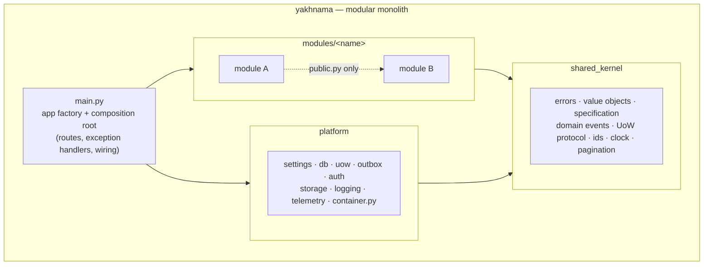
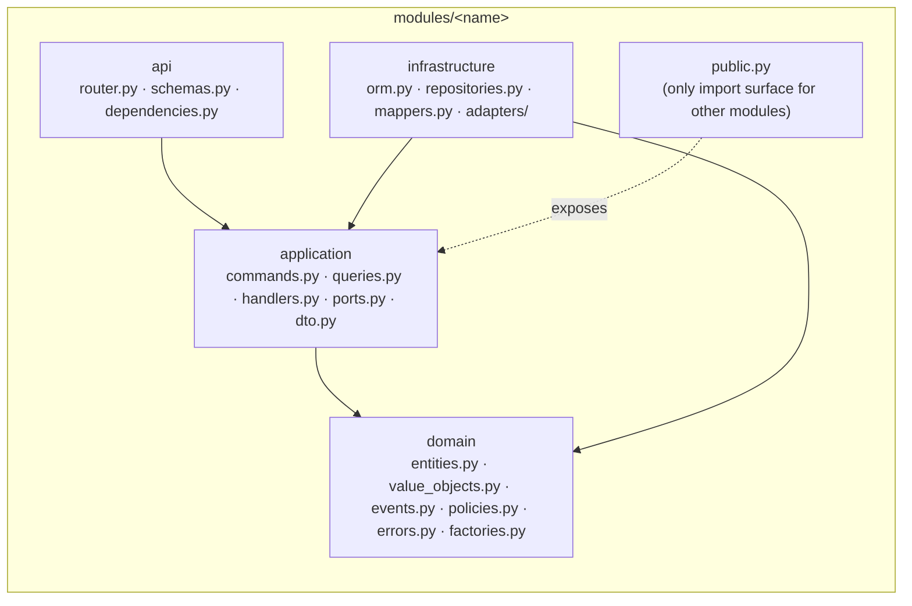
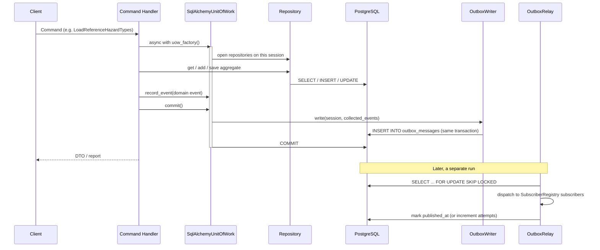

# Architecture

## Purpose

This page orients a new contributor or reviewer in the shape of the backend before they
read code: the modular-monolith boundary, the hexagonal layers inside each module, the
read/write flow, and where errors are handled. It condenses `AGENTS.md` §2–§3; where the
two disagree, `AGENTS.md` is binding.

## Modular monolith

Yakhnama is one deployable service, not microservices. Each bounded context is a module
under `src/yakhnama/modules/<name>/`. Modules never import each other's internals — only
the other module's `public.py` facade — so the boundaries that matter for a future split
are enforced today by `lint-imports`, not just convention.

`main.py` and `platform/container.py` are the only two composition roots: the only places
allowed to bind a port (a `typing.Protocol` in `application/ports.py`) to a concrete
adapter.

## Hexagonal layers, per module

Every module has the same four layers, and dependencies point only inward:

`domain` never imports FastAPI, SQLAlchemy, httpx, Shapely, boto, or anything in
`platform`/`infrastructure`; it depends only on the standard library, Pydantic,
`geojson-pydantic` and `shared_kernel`. This is enforced by the `import-linter` contracts
in `pyproject.toml` (`poetry run poe arch`).

## Module map

The concepts below come from the glossary in `AGENTS.md` §7. The pattern catalog in
`AGENTS.md` §3 names the following modules explicitly; additional bounded contexts (for
example dedicated modules for impact claims, sources or places, as opposed to their being
owned by `events`) are proposed and recorded as they are decided, in `docs/adr/`.

| Module | Owns (per the glossary) | Key rule |
|--------|--------------------------|----------|
| `reports` | Report intake and triage | A report is never trusted by default and never edited after submission; corrections are new revisions. Report triage checks use a Chain of Responsibility. |
| `events` | Event, Best figure | An event is the canonical record, created or merged by moderators through verification. Event creation from reports uses a Factory; the best figure is a documented aggregation policy over impact claims. |
| `hazards` | Hazard type | A node in the IRDR-aligned taxonomy with a stable code, retired but never reused or deleted. Hazard-specific attributes use a Strategy + Registry (discriminated unions). |
| `verification` | Verification case | The state-machine record attached to a report, event or claim; only a human moves it to `verified`. Modelled as an explicit State transition table. |
| `identity` | Authorisation | Authorisation rules are a composable, Specification-style Policy. |
| `ingestion` | External data intake | Ingestion pipelines use a Template Method. |
| `exchange` | Import/export formats | One Importer/Exporter per format (GeoJSON, CSV, GeoParquet — fixed by the project specification; the `exchange` module arrives in Phase 4), via Strategy + Registry. |

`shared_kernel` and `platform` are not bounded contexts; they are the framework-free
building blocks and the cross-cutting infrastructure every module depends on (see the
diagram above).

## Reads and writes (CQRS-lite)

- **Write:** a Pydantic `Command` → a `Handler` (`application/handlers.py`) → a `Unit of
  Work` → repositories → entities → domain events, written to the transactional
  `Outbox` in the same transaction and relayed to subscribers afterward.
- **Read:** a `Query` served by a `Query Service` behind a port, with optimised SQL in
  `infrastructure`, returning `DTO`s directly — it never goes through the write model or
  domain entities.

Handlers and query services are plain callables wired in the composition root
(`main.py`, `platform/container.py`), not a mediator library.

## Error mapping

All domain errors derive from `shared_kernel.errors.YakhnamaError`: `NotFoundError`,
`ConflictError`, `ValidationError`, `PermissionDeniedError`, `InvariantViolationError`,
`InvalidTransitionError`. They are mapped to
[RFC 9457](https://www.rfc-editor.org/rfc/rfc9457) Problem Details in exactly one place —
the exception handlers registered in `main.py` — so no module or layer below `api`
formats an HTTP response.

## Phase 1 state

Phase 1 (`docs/plans/phase-1.md`) added the shared kernel, the database and outbox
platform, and three reference-data modules with domain, application and persistence
layers. The module map above stays the description of every eventual bounded context;
this section records what actually exists after Phase 1.

### Module map (Phase 1)

| Module | Owns | Key rule | Status |
|--------|------|----------|--------|
| `geography` | `AdminLevel`, `Place` aggregate, `PlaceName` | A place is never deleted, only retired or merged; at most one preferred name per language (`src/yakhnama/modules/geography/domain/entities.py`, `docs/data-dictionary/geography.md`). | domain + application + persistence |
| `hazards` | `HazardType` taxonomy, hazard attribute schemas (Strategy + Registry), `GlacierRef`/`GlacialLakeRef` | A hazard type code is retired, never reused or deleted; attribute payloads validate against `DEFAULT_REGISTRY` (`src/yakhnama/modules/hazards/domain/`, `docs/data-dictionary/hazards.md`). | domain + application + persistence |
| `impacts` | `ImpactMetric` registry | `category`, `value_kind`, `unit`, `currency` and `aggregation` are immutable once a metric exists; a metric code is never reused (`src/yakhnama/modules/impacts/domain/entities.py`, `docs/data-dictionary/impacts.md`). | domain + application + persistence (registry only; claims arrive in Phase 3) |

Each module follows the layer rules in `AGENTS.md` §2.1 and exposes only `public.py` to
the other two and to `yakhnama.seed`; `pyproject.toml`'s `[tool.importlinter]` contracts
enforce this and the hexagonal layering inside each module.

### The seed flow

`poetry run poe seed` (`src/yakhnama/seed/__main__.py`) runs
`SeedReferenceDataHandler` (`src/yakhnama/seed/application.py`), which:

1. Checks a `SeedPolicy` (an allow-list placeholder until Phase 2's identity policies
   land) before touching anything.
2. Reads each versioned file in `data/reference/` through the `ReferenceFileReader`
   port, validating it against that module's reference-file model.
3. Hands each parsed file to its module's load command handler, in order — hazard
   types, then impact metrics, then places — because later records refer to hazard
   types and metrics by code.
4. Each module's loader runs in its own unit of work and is idempotent: it upserts by
   code, never deletes, and applies only labels, retirement status, names and
   centroids in place on a re-run, reporting anything else as skipped for a human
   (`docs/open-questions.md`, Q41–Q44).

The seed is therefore not one atomic transaction across modules; re-running it after a
partial failure completes the work without duplicating anything, because every
individual load is idempotent.

### Platform pieces added in Phase 1

- **`platform/container.py`** — the second composition root (`AGENTS.md` §2.1). Builds
  the database engine and session factory, binds `Clock` and `IdGenerator`, and
  constructs one `OutboxWriter`, one `SubscriberRegistry` and one `OutboxRelay` shared
  by the whole application.
- **`platform/uow.py`** — `SqlAlchemyUnitOfWork` implements the `UnitOfWork` protocol
  from `shared_kernel/uow.py`. A module subclasses it, overriding
  `_open_repositories` to build its SQLAlchemy repositories on the session the unit of
  work opened; `platform/container.py` binds a `SqlAlchemyUnitOfWorkFactory` per module
  to that module's `UnitOfWorkFactory` port. On `commit`, the unit of work stages the
  collected domain events as outbox rows in the same session before committing, so the
  aggregate write and its events are atomic (ADR 0007).
- **`platform/outbox/writer.py`** — serialises each `DomainEvent` into an
  `OutboxMessage` row and stages it with `session.add`; it never flushes or commits
  itself.
- **`platform/outbox/relay.py`** — `OutboxRelay.relay_once` claims pending rows with
  `SELECT ... FOR UPDATE SKIP LOCKED` (safe under concurrent relays), dispatches each
  to its `SubscriberRegistry` subscribers and marks it published only once every
  subscriber returns without raising — **at-least-once delivery**, so every subscriber
  must be idempotent, keyed by `OutboxEnvelope.event_id`. A failure increments
  `attempts` and stores only the error type in `last_error` (never the exception text
  or the payload, per `AGENTS.md` §5); after `max_attempts` (default 5) a message stops
  being claimed until a human or a future dead-letter process handles it
  (`docs/open-questions.md`, Q47).
- **`platform/telemetry.py`** — `configure_telemetry` instruments FastAPI and
  SQLAlchemy with OpenTelemetry when enabled. `PersonalDataSpanProcessor` strips query
  strings and redacts client address, port and user agent on every span as it starts;
  `PersonalDataSpanExporter` wraps every exporter so exception text (driver messages,
  stack traces) never leaves the process, keeping only the exception type and status
  code (`AGENTS.md` §5). The OTLP exporter is not installed yet
  (`docs/open-questions.md`, Q46).
- **`platform/health.py`** — `/health/live` checks nothing (a database outage must not
  make an orchestrator restart healthy processes); `/health/ready` runs `SELECT 1`
  against the engine within a configurable timeout and returns HTTP 503 when it fails.
  The object storage check joins in Phase 3, when the storage port exists.

### A write, end to end

## Further reading

- Architecture decisions: [`../adr/`](../adr/README.md) (MADR format).
- Data dictionary conventions and the module pages:
  [`../data-dictionary/README.md`](../data-dictionary/README.md).
- Open questions raised while building Phase 1: [`../open-questions.md`](../open-questions.md).
- External data source adapters: `data-sources.md`, added in Phase 4 alongside the
  `add-source-adapter` skill.
