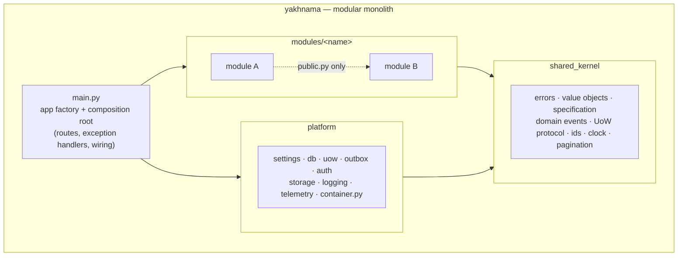
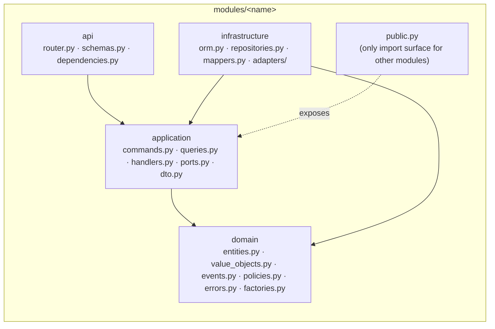

# Architecture

## Purpose

This page orients a new contributor or reviewer in the shape of the backend before they
read code: the modular-monolith boundary, the hexagonal layers inside each module, the
read/write flow, and where errors are handled. It condenses `AGENTS.md` §2–§3; where the
two disagree, `AGENTS.md` is binding.

## Modular monolith

Yakhnama is one deployable service, not microservices. Each bounded context is a module
under `src/yakhnama/modules/<name>/`. Modules never import each other's internals — only
the other module's `public.py` facade — so the boundaries that matter for a future split
are enforced today by `lint-imports`, not just convention.

`main.py` and `platform/container.py` are the only two composition roots: the only places
allowed to bind a port (a `typing.Protocol` in `application/ports.py`) to a concrete
adapter.

## Hexagonal layers, per module

Every module has the same four layers, and dependencies point only inward:

`domain` never imports FastAPI, SQLAlchemy, httpx, Shapely, boto, or anything in
`platform`/`infrastructure`; it depends only on the standard library, Pydantic,
`geojson-pydantic` and `shared_kernel`. This is enforced by the `import-linter` contracts
in `pyproject.toml` (`poetry run poe arch`).

## Module map

The concepts below come from the glossary in `AGENTS.md` §7. The pattern catalog in
`AGENTS.md` §3 names the following modules explicitly; additional bounded contexts (for
example dedicated modules for impact claims, sources or places, as opposed to their being
owned by `events`) are proposed and recorded as they are decided, in `docs/adr/`.

| Module | Owns (per the glossary) | Key rule |
|--------|--------------------------|----------|
| `reports` | Report intake and triage | A report is never trusted by default and never edited after submission; corrections are new revisions. Report triage checks use a Chain of Responsibility. |
| `events` | Event, Best figure | An event is the canonical record, created or merged by moderators through verification. Event creation from reports uses a Factory; the best figure is a documented aggregation policy over impact claims. |
| `hazards` | Hazard type | A node in the IRDR-aligned taxonomy with a stable code, retired but never reused or deleted. Hazard-specific attributes use a Strategy + Registry (discriminated unions). |
| `verification` | Verification case | The state-machine record attached to a report, event or claim; only a human moves it to `verified`. Modelled as an explicit State transition table. |
| `identity` | Authorisation | Authorisation rules are a composable, Specification-style Policy. |
| `ingestion` | External data intake | Ingestion pipelines use a Template Method. |
| `exchange` | Import/export formats | One Importer/Exporter per format (GeoJSON, CSV, GeoParquet — fixed by the project specification; the `exchange` module arrives in Phase 4), via Strategy + Registry. |

`shared_kernel` and `platform` are not bounded contexts; they are the framework-free
building blocks and the cross-cutting infrastructure every module depends on (see the
diagram above).

## Reads and writes (CQRS-lite)

- **Write:** a Pydantic `Command` → a `Handler` (`application/handlers.py`) → a `Unit of
  Work` → repositories → entities → domain events, written to the transactional
  `Outbox` in the same transaction and relayed to subscribers afterward.
- **Read:** a `Query` served by a `Query Service` behind a port, with optimised SQL in
  `infrastructure`, returning `DTO`s directly — it never goes through the write model or
  domain entities.

Handlers and query services are plain callables wired in the composition root
(`main.py`, `platform/container.py`), not a mediator library.

## Error mapping

All domain errors derive from `shared_kernel.errors.YakhnamaError`: `NotFoundError`,
`ConflictError`, `ValidationError`, `PermissionDeniedError`, `InvariantViolationError`,
`InvalidTransitionError`. They are mapped to
[RFC 9457](https://www.rfc-editor.org/rfc/rfc9457) Problem Details in exactly one place —
the exception handlers registered in `main.py` — so no module or layer below `api`
formats an HTTP response.

## Further reading

- Architecture decisions: [`../adr/`](../adr/README.md) (MADR format, numbered `0001`–`0010` in
  Phase 0).
- Data dictionary conventions: [`../data-dictionary/README.md`](../data-dictionary/README.md).
- External data source adapters: `data-sources.md`, added in Phase 4 alongside the
  `add-source-adapter` skill.
