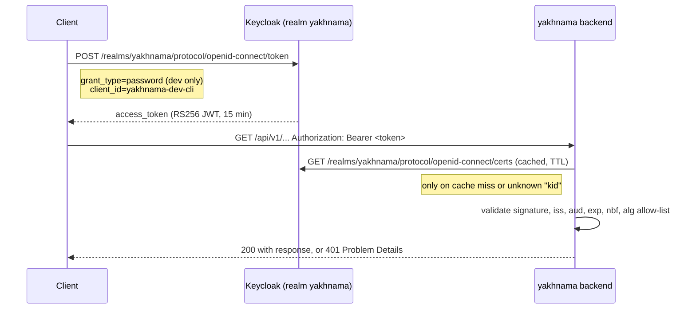

# Authentication and authorisation (development)

## Purpose

This page documents the development token flow set up by ADR 0005 (OIDC-only
authentication): how a client obtains a bearer JWT from the local Keycloak realm, how the
backend validates it, and the realm contents behind
`docker/keycloak/yakhnama-realm.json`. It is the companion to ADR 0005, which fixes the
*approach*; this page fixes the *development instance*.

!!! warning "Development only"
    Everything on this page — the `yakhnama-dev-cli` client, its direct access grants
    (resource-owner password flow), and the two demo users and their passwords — exists
    only in the local development realm. Direct access grants and demo accounts are never
    enabled in a production identity provider. Production provider choice is tracked in
    `docs/open-questions.md`.

## Token flow



The backend never calls Keycloak's token endpoint itself and never sees a password: it
only verifies bearer tokens presented by clients against the realm's JSON Web Key Set
(JWKS), cached with a TTL and refreshed on an unknown `kid` to follow key rotation
(ADR 0005; validator implementation in `platform/auth/`).

## The `yakhnama` realm

Defined in `docker/keycloak/yakhnama-realm.json` and imported automatically by
`docker compose up` (`--import-realm` on the `keycloak` service, reading the mounted
`docker/keycloak/` directory). Re-importing is skipped once the realm exists in the
`keycloak-data` volume; to force a re-import after editing the file, remove that volume
(`docker compose down keycloak && docker volume rm yakhnama_keycloak-data`) before
`poe up` again.

### Clients

| Client | Type | Purpose |
|--------|------|---------|
| `yakhnama-api` | confidential, bearer-only | Identifies the backend as the audience (`aud`) of access tokens. Never used to authenticate; it has no login flow. |
| `yakhnama-dev-cli` | public, direct access grants enabled | **Development only.** Lets a developer or test exchange a demo username and password for a token from the command line. Carries a protocol mapper that adds `yakhnama-api` to the token's `aud` claim, and a realm-roles mapper that copies the user's realm roles into `realm_access.roles`. |

### Roles

`citizen` (the realm's default role, granted to every user), `trusted_reporter`,
`org_member`, `org_admin`, `moderator`, `admin` — the `Role` enum from
`modules/identity/domain` (plan Q2, phase-2 plan §7). Realm roles are mirrored onto the
backend's `User` entity the first time a token from that subject is seen
(`EnsureUserFromPrincipal`); roles beyond what the realm grants (for example promoting a
user to `moderator` or `admin` purely inside the application, without a matching realm
role) are added only by an admin through the identity module, never inferred from a
token. See plan Q2 for the open question this leaves about drift between realm roles and
module-granted roles.

### Demo users

Two users exist only for local development and manual testing, with dev-only passwords
that are **not secrets** (they unlock nothing but a local, disposable container):

| Username | Password | Roles |
|----------|----------|-------|
| `demo-citizen` | `demo-citizen-dev-only` | `citizen` |
| `demo-moderator` | `demo-moderator-dev-only` | `citizen`, `moderator` |

Both have `emailVerified: true` but **no email address**. The realm's user profile is
customised (the `components` section of the realm export) to drop the default `firstName`
and `lastName` requirements and to make `email` optional, because the backend never
stores email or other personal contact data (`AGENTS.md` §5, plan Q4) — Keycloak's
built-in profile schema does not allow removing the `email` attribute entirely, so it stays
present but unrequired and empty.

## Obtaining a token

With the stack running (`poetry run poe up`), read the Keycloak port from `.env`
(`KEYCLOAK_HOST_PORT`, default `8080`) and:

```bash
curl -s -X POST "http://127.0.0.1:${KEYCLOAK_HOST_PORT:-8080}/realms/yakhnama/protocol/openid-connect/token" \
  -d client_id=yakhnama-dev-cli \
  -d grant_type=password \
  -d username=demo-citizen \
  -d password=demo-citizen-dev-only
```

The response is a standard OIDC token response (`access_token`, `refresh_token`,
`expires_in`, ...). Use the `access_token` as a bearer token:
`Authorization: Bearer <access_token>`.

The JWKS the backend validates against is at
`http://127.0.0.1:${KEYCLOAK_HOST_PORT:-8080}/realms/yakhnama/protocol/openid-connect/certs`.

## The exact-issuer pitfall

Keycloak sets the token's `iss` claim to the base URL a client used to *call* the token
endpoint, not a fixed configured value — for example
`http://127.0.0.1:18080/realms/yakhnama` when called through a remapped host port, or
`http://keycloak:8080/realms/yakhnama` when called from inside the Docker network. The
backend's `YAKHNAMA_OIDC_ISSUER` setting must match the issuer the *client population
that calls the backend* will actually see, character for character (the validator rejects
any other value). In local development that is ordinarily
`http://127.0.0.1:${KEYCLOAK_HOST_PORT:-8080}/realms/yakhnama`; if the host port is
remapped in `.env`, `YAKHNAMA_OIDC_ISSUER` must be updated to match.

## Settings the backend reads

| Setting | Meaning | Local development default |
|---------|---------|----------------------------|
| `YAKHNAMA_OIDC_ISSUER` | Expected `iss` claim; must match exactly (see above) | `http://127.0.0.1:8080/realms/yakhnama` |
| `YAKHNAMA_OIDC_AUDIENCE` | Expected `aud` claim | `yakhnama-api` |
| `YAKHNAMA_OIDC_JWKS_URL` | Where the JWKS is fetched and cached from | `http://127.0.0.1:8080/realms/yakhnama/protocol/openid-connect/certs` |

These are read by `platform/settings.py` and consumed by the JWKS client and
`TokenValidator` in `platform/auth/` (phase-2 plan T4); see `docs/adr/0005-oidc-only-authentication.md`
for the validation rules (`iss`, `aud`, `exp`, `nbf`, algorithm allow-list).

## More information

- `docs/adr/0005-oidc-only-authentication.md` — the decision and its trade-offs.
- `docs/plans/phase-2.md` §7 (Q1, Q2) — the `aud` value and realm-role-vs-module-role
  open questions.
- `docker/keycloak/yakhnama-realm.json` — the realm export imported on `poe up`.
