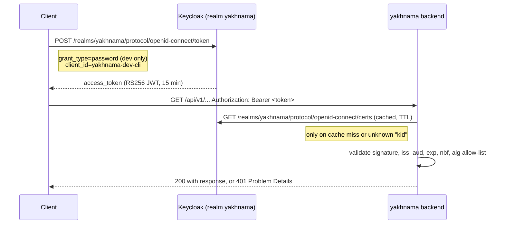

# Authentication and authorisation (development)

## Purpose

This page documents the development token flow set up by ADR 0005 (OIDC-only
authentication): how a client obtains a bearer JWT from the local Keycloak realm, how the
backend validates it, and the realm contents behind
`docker/keycloak/yakhnama-realm.json`. It is the companion to ADR 0005, which fixes the
*approach*; this page fixes the *development instance*.

!!! warning "Development only"
    Everything on this page — the `yakhnama-dev-cli` client, its direct access grants
    (resource-owner password flow), and the two demo users and their passwords — exists
    only in the local development realm. Direct access grants and demo accounts are never
    enabled in a production identity provider. Production provider choice is tracked in
    `docs/open-questions.md`.

## Token flow



The backend never calls Keycloak's token endpoint itself and never sees a password: it
only verifies bearer tokens presented by clients against the realm's JSON Web Key Set
(JWKS), cached with a TTL and refreshed on an unknown `kid` to follow key rotation
(ADR 0005; validator implementation in `platform/auth/`).

## The `yakhnama` realm

Defined in `docker/keycloak/yakhnama-realm.json` and imported automatically by
`docker compose up` (`--import-realm` on the `keycloak` service, reading the mounted
`docker/keycloak/` directory). Re-importing is skipped once the realm exists in the
`keycloak-data` volume; to force a re-import after editing the file, remove that volume
(`docker compose down keycloak && docker volume rm yakhnama_keycloak-data`) before
`poe up` again.

### Clients

| Client | Type | Purpose |
|--------|------|---------|
| `yakhnama-api` | confidential, bearer-only | Identifies the backend as the audience (`aud`) of access tokens. Never used to authenticate; it has no login flow. |
| `yakhnama-dev-cli` | public, direct access grants enabled | **Development only.** Lets a developer or test exchange a demo username and password for a token from the command line. Carries a protocol mapper that adds `yakhnama-api` to the token's `aud` claim, and a realm-roles mapper that copies the user's realm roles into `realm_access.roles`. |

### Roles

`citizen` (the realm's default role, granted to every user), `trusted_reporter`,
`org_member`, `org_admin`, `moderator`, `admin` — the `Role` enum from
`modules/identity/domain` (plan Q2, phase-2 plan §7). Realm roles are mirrored onto the
backend's `User` entity the first time a token from that subject is seen
(`EnsureUserFromPrincipal`); roles beyond what the realm grants (for example promoting a
user to `moderator` or `admin` purely inside the application, without a matching realm
role) are added only by an admin through the identity module, never inferred from a
token. See plan Q2 for the open question this leaves about drift between realm roles and
module-granted roles.

### Demo users

Two users exist only for local development and manual testing, with dev-only passwords
that are **not secrets** (they unlock nothing but a local, disposable container):

| Username | Password | Roles |
|----------|----------|-------|
| `demo-citizen` | `demo-citizen-dev-only` | `citizen` |
| `demo-moderator` | `demo-moderator-dev-only` | `citizen`, `moderator` |

Both have `emailVerified: true` but **no email address**. The realm's user profile is
customised (the `components` section of the realm export) to drop the default `firstName`
and `lastName` requirements and to make `email` optional, because the backend never
stores email or other personal contact data (`AGENTS.md` §5, plan Q4) — Keycloak's
built-in profile schema does not allow removing the `email` attribute entirely, so it stays
present but unrequired and empty.

## Obtaining a token

With the stack running (`poetry run poe up`), read the Keycloak port from `.env`
(`KEYCLOAK_HOST_PORT`, default `8080`) and:

```bash
curl -s -X POST "http://127.0.0.1:${KEYCLOAK_HOST_PORT:-8080}/realms/yakhnama/protocol/openid-connect/token" \
  -d client_id=yakhnama-dev-cli \
  -d grant_type=password \
  -d username=demo-citizen \
  -d password=demo-citizen-dev-only
```

The response is a standard OIDC token response (`access_token`, `refresh_token`,
`expires_in`, ...). Use the `access_token` as a bearer token:
`Authorization: Bearer <access_token>`.

The JWKS the backend validates against is at
`http://127.0.0.1:${KEYCLOAK_HOST_PORT:-8080}/realms/yakhnama/protocol/openid-connect/certs`.

## The exact-issuer pitfall

Keycloak sets the token's `iss` claim to the base URL a client used to *call* the token
endpoint, not a fixed configured value — for example
`http://127.0.0.1:18080/realms/yakhnama` when called through a remapped host port, or
`http://keycloak:8080/realms/yakhnama` when called from inside the Docker network. The
backend's `YAKHNAMA_OIDC_ISSUER` setting must match the issuer the *client population
that calls the backend* will actually see, character for character (the validator rejects
any other value). In local development that is ordinarily
`http://127.0.0.1:${KEYCLOAK_HOST_PORT:-8080}/realms/yakhnama`; if the host port is
remapped in `.env`, `YAKHNAMA_OIDC_ISSUER` must be updated to match.

## Settings the backend reads

| Setting | Meaning | Local development default |
|---------|---------|----------------------------|
| `YAKHNAMA_OIDC_ISSUER` | Expected `iss` claim; must match exactly (see above) | `http://127.0.0.1:8080/realms/yakhnama` |
| `YAKHNAMA_OIDC_AUDIENCE` | Expected `aud` claim | `yakhnama-api` |
| `YAKHNAMA_OIDC_JWKS_URL` | Where the JWKS is fetched and cached from | `http://127.0.0.1:8080/realms/yakhnama/protocol/openid-connect/certs` |

These are read by `platform/settings.py` and consumed by the JWKS client and
`TokenValidator` in `platform/auth/` (phase-2 plan T4); see `docs/adr/0005-oidc-only-authentication.md`
for the validation rules (`iss`, `aud`, `exp`, `nbf`, algorithm allow-list).

## The backend side

This section documents what `platform/auth/` and `modules/identity/` do with a token once
it reaches the backend, as implemented in Phase 2 (ADR 0015 is the design record; this is
the as-built summary). See `docs/architecture/api.md` for how authentication fits into the
rest of the API (errors, the route table, rate limiting).

### Validator checks

`TokenValidator` (`platform/auth/tokens.py`) rejects a token unless, in order:

1. It is at most 8192 characters (a longer value is refused unparsed, to bound the work a
   hostile client can force).
2. Its header's `alg` is in `oidc_allowed_algorithms` (`RS256` and/or `ES256` only — `none`
   and the symmetric `HS*` family cannot even be configured, closing algorithm confusion by
   construction).
3. Its `kid` resolves to a JWK of the matching key type in the cached JWKS (symmetric and
   encryption-use keys are dropped when the JWKS is parsed, so they can never be selected).
4. PyJWT verifies the signature against that key and checks that `iss`, `aud`, `exp`,
   `iat` and `sub` are present, that `iss` equals `oidc_issuer` exactly (character for
   character — see "The exact-issuer pitfall" above) and that `aud` contains
   `oidc_audience`.
5. `exp`, `nbf` (when present) and `iat` are checked again by `TokenValidator` against the
   platform's injected `Clock` (never the wall clock, so tests control time) with
   `oidc_leeway_seconds` (0–60, default 10) of tolerance.
6. Bounds on individual claims: `sub` at most 255 characters, each role name at most 100,
   at most 100 roles, `display_name` at most 200.

Every rejection raises the same `AuthenticationError` (HTTP 401,
`WWW-Authenticate: Bearer realm="yakhnama"`) with a fixed, generic message; only the reason
(a PyJWT error type or a fixed slug) is logged, as `bearer_token_rejected` — the token text
itself is never logged. A provider that cannot be reached raises
`IdentityProviderUnavailableError` (HTTP 503) instead, because the token is not at fault.
`oidc_issuer = None` (the setting's default) disables authentication outright: every
presented token is rejected and every protected route answers 401, which is why local
development must set `YAKHNAMA_OIDC_ISSUER` to use anything beyond the public reference
data.

### JWKS cache and rotation

`HttpJwksClient` (`platform/auth/jwks.py`) fetches `oidc_jwks_url`, or discovers it once
from `<issuer>/.well-known/openid-configuration` (whose own `issuer` must equal the
configured one and whose `jwks_uri` must be `https`, or `http` on a loopback host — the
same rule `Settings` applies to `oidc_issuer` and `oidc_jwks_url` themselves). Keys are
cached for `jwks_cache_ttl_seconds` (60–86400, default 600, `YAKHNAMA_JWKS_CACHE_TTL_SECONDS`
in `.env.example`). An unknown `kid` — the sign that Keycloak rotated its signing key —
triggers exactly one refetch, at most once per 30 seconds measured from the last attempt,
so a flood of made-up `kid` values cannot turn the API into a load generator against the
identity provider; a failed forced refetch keeps serving the still-fresh cache rather than
failing every request. Concurrent fetches are serialised by a lock, time out after
`oidc_http_timeout_seconds`, never follow redirects, and refuse a document larger than
256 KiB. No test in this repository ever reaches a real identity provider: tests sign
tokens with a locally generated key and serve JWKS through a fake
(`AGENTS.md` §5, ADR 0015).

### Role mapping

A token's roles come from Keycloak's `realm_access.roles`, merged with a top-level `roles`
claim if present, into `Principal.realm_roles` (`platform/auth/principal.py`) — the only
view the rest of the backend has of "who is calling", together with `subject`, `issuer`,
`display_name` (from `preferred_username` only, never `name`, and never stored: users set a name through `PATCH /api/v1/me`), `token_id` (`jti`) and
`expires_at`. `platform/auth` is the only place that knows these claim names (ADR 0005);
everything past it deals only in `Principal` and, once mirrored, `Actor`.

`map_realm_roles` (`modules/identity/api/dependencies.py`) then maps each realm role name
to a `Role` by exact value match; names that are not one of Yakhnama's roles (Keycloak's
own `offline_access`, `default-roles-*` and the like) are silently ignored rather than
rejected, since a realm can carry roles unrelated to this application.

### First-sight mirroring

The first time a request from a given `(issuer, subject)` pair passes authentication,
`EnsureUserFromPrincipalHandler` mirrors it into a `User` row (`identity.user_mirrored`),
copying the mapped realm roles and the display name at that moment. Every later request
from the same subject reuses the existing `User` and does **not** re-copy realm roles: a
role added or removed at the identity provider after first sight has no effect on the
mirrored user until an admin changes it inside Yakhnama. This is a deliberate Phase 2
scope decision, not an oversight — see `docs/open-questions.md` Q50 (`docs/data-dictionary/identity.md`
Q-I1) for why, and what re-synchronisation would need before production.

### The production guard

`Settings`' `_guard_production` validator (`platform/settings.py`) refuses to start with
`environment = "production"` unless, among the other Phase 1 security-review rules:

- `oidc_issuer` is set (authentication cannot be silently disabled in production);
- `rate_limit_enabled` is true and `rate_limit_backend` is `redis` (an in-memory limiter
  would not be shared across production processes);
- `docs_enabled` is false (no Scalar page, and therefore no CDN-loaded bundle, in
  production — see `docs/open-questions.md` Q68);
- `cors_allow_origins` holds only `https` or loopback origins, never `*`;
- `log_format` is `json` and `otel_exporter` is not `console`;
- `database_url` is not the development default and `trusted_hosts` does not contain `*`.

Every broken rule is collected and reported together (`production_problems`), by field name
only, never by value, so an operator sees every mistake in one failed start instead of one
per redeploy.

## More information

- `docs/adr/0005-oidc-only-authentication.md` — the decision and its trade-offs.
- `docs/adr/0015-jwt-validation-with-pyjwt-and-a-cached-jwks.md` — the validator and JWKS
  client design record this section summarises as built.
- `docs/architecture/api.md` — how authentication fits the rest of the API surface.
- `docs/plans/phase-2.md` §7 (Q1, Q2) — the `aud` value and realm-role-vs-module-role
  open questions, also recorded as Q72–Q73 in `docs/open-questions.md`.
- `docker/keycloak/yakhnama-realm.json` — the realm export imported on `poe up`.
