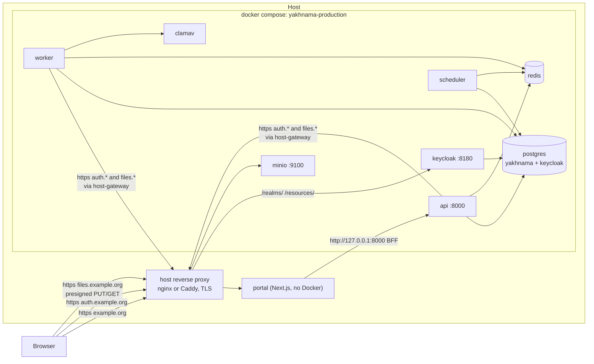

# Production deployment

## Purpose

How the backend runs in production on one server with Docker Compose, and what an
operator does to install and upgrade it. The decision and its trade-offs are in
[ADR 0023](../adr/0023-production-packaging-and-deployment-topology.md). Files:

| File | What it is |
|------|------------|
| `Dockerfile` | The one backend image: API, worker, scheduler and one-shot commands |
| `.dockerignore` | Allow-list of what the image may contain |
| `docker-compose.production.yml` | The production stack (separate from the development `docker-compose.yml`) |
| `production.env.example` | Every variable the stack needs, with placeholders; copy to `.env.production` |
| `docker/keycloak/production/` | Keycloak's production image, its database init script and its realm instructions |
| `src/yakhnama/platform/keycloak_realm.py` | Derives the production realm from the development one |

## Topology



Every published port binds to 127.0.0.1. The API is reached only by the portal's server;
Keycloak and MinIO are public only through the reverse proxy. PostgreSQL, Redis and clamd
publish nothing.

The API and the worker call Keycloak and MinIO by their **public https names**, not by
their compose service names: the production guard refuses a plain-http storage endpoint
or issuer, and the backend has one storage endpoint for its own calls and for the host
inside presigned URLs (Q120). `extra_hosts` points both names at the host
(`REVERSE_PROXY_ADDRESS`, default `host-gateway`), so the containers reach the host's
proxy directly. The proxy must therefore listen on all addresses (`listen 443`), and a
host firewall must let the Docker networks reach port 443.

## Install

```bash
alias dcp='docker compose -f docker-compose.production.yml --env-file .env.production'

# 1. Configuration: fill in every change-me and example.org (instructions in the file).
cp production.env.example .env.production && chmod 600 .env.production

# 2. Images: build on the server ...
dcp build
#    ... or build elsewhere and copy them (no registry needed):
#    docker save yakhnama-api:local yakhnama-keycloak:local | gzip | ssh <server> 'gunzip | docker load'

# 3. The production realm (docker/keycloak/production/README.md).
mkdir -p docker/keycloak/production/import
docker run --rm -i yakhnama-api:local python -m yakhnama.platform.keycloak_realm \
  --portal-origin https://example.org --source - < docker/keycloak/yakhnama-realm.json \
  > docker/keycloak/production/import/yakhnama-realm.production.json

# 4. DNS for auth.* and files.*, certificates, and the reverse proxy (below).

# 5. Start. `migrate` (alembic upgrade head) and `minio-init` run first and exit 0;
#    api, worker and scheduler start after them.
dcp up -d
dcp ps -a

# 6. Reference data, then the district boundaries (downloads about 29 MB once).
dcp run --rm migrate python -m yakhnama.seed
dcp run --rm migrate python -m yakhnama.seed.boundaries --dry-run
dcp run --rm migrate python -m yakhnama.seed.boundaries

# 7. Keycloak admin and the first Yakhnama administrator: see
#    docker/keycloak/production/README.md, sections 3 and 4.
curl -s http://127.0.0.1:8000/health/ready
```

The portal then uses `YAKHNAMA_API_URL=http://127.0.0.1:8000`,
`OIDC_ISSUER=https://auth.example.org/realms/yakhnama` and
`MEDIA_UPLOAD_ORIGIN=https://files.example.org`.

ClamAV needs a few minutes on the first start to load (and possibly download) its
signatures; uploads scanned before then are marked `unavailable` and are not published.

## Upgrade

```bash
git pull                # a reviewed release commit
dcp build
dcp up -d               # migrate runs again before the application restarts
```

## Reverse proxy

The proxy terminates TLS (for example with Let's Encrypt; the backend verifies these
certificates with the public CA bundle) and forwards to the loopback ports. Keycloak
gets only `/realms/` and `/resources/`: the admin console stays on the loopback port.
MinIO must receive the `Host` header unchanged, because it is part of every presigned
URL's signature, and must accept bodies of up to 50 MiB (the upload cap) plus overhead.
`X-Forwarded-For` is set to the peer address, never appended to what the client sent.

### nginx

```nginx
server {
    listen 443 ssl;
    listen [::]:443 ssl;
    http2 on;
    server_name auth.example.org;
    ssl_certificate     /etc/letsencrypt/live/auth.example.org/fullchain.pem;
    ssl_certificate_key /etc/letsencrypt/live/auth.example.org/privkey.pem;

    proxy_set_header Host              $host;
    proxy_set_header X-Forwarded-For   $remote_addr;
    proxy_set_header X-Forwarded-Proto https;
    proxy_set_header X-Forwarded-Host  $host;
    proxy_set_header X-Forwarded-Port  443;
    proxy_buffer_size 128k;            # Keycloak's cookies and headers are large
    proxy_buffers 4 256k;

    location /realms/    { proxy_pass http://127.0.0.1:8180; }
    location /resources/ { proxy_pass http://127.0.0.1:8180; }
    location /           { return 404; }
}

server {
    listen 443 ssl;
    listen [::]:443 ssl;
    http2 on;
    server_name files.example.org;
    ssl_certificate     /etc/letsencrypt/live/files.example.org/fullchain.pem;
    ssl_certificate_key /etc/letsencrypt/live/files.example.org/privkey.pem;

    client_max_body_size 55m;          # uploads are at most 50 MiB
    proxy_request_buffering off;       # stream uploads instead of spooling them
    proxy_buffering off;

    location / {
        proxy_pass http://127.0.0.1:9100;
        proxy_http_version 1.1;
        proxy_set_header Connection        "";
        proxy_set_header Host              $http_host;   # signed: never rewrite
        proxy_set_header X-Forwarded-For   $remote_addr;
        proxy_set_header X-Forwarded-Proto https;
        proxy_connect_timeout 60s;
        proxy_send_timeout    300s;
        proxy_read_timeout    300s;
    }
}
```

### Caddy

```caddyfile
auth.example.org {
	@public path /realms/* /resources/*
	handle @public {
		reverse_proxy 127.0.0.1:8180
	}
	handle {
		respond 404
	}
}

files.example.org {
	request_body {
		max_size 55MB
	}
	reverse_proxy 127.0.0.1:9100
}
```

Caddy obtains the certificates itself, passes `Host` through and replaces any
`X-Forwarded-For` from an untrusted client with the peer address.

## Resources

Measured on 2026-10-07 with the stack idle after start-up (`docker stats`), against the
compose memory limits:

| Container | Idle memory | Limit | Notes |
|-----------|-------------|-------|-------|
| api | 333 MiB | 768 MiB | two uvicorn processes (`WEB_CONCURRENCY=2`) |
| worker | 175 MiB | 1 GiB | one taskiq process plus its supervisor; photos and exports need headroom |
| scheduler | 139 MiB | 256 MiB | |
| keycloak | 642 MiB | 1.25 GiB | heap 256 to 768 MiB |
| clamav | 950 MiB | 2 GiB | grows to about 1.2 GB with daily signatures; no concurrent reload |
| minio | 271 MiB | 512 MiB | `MINIO_CONSOLE=off` saves a little |
| postgres | 42 MiB | 1 GiB | rises towards `shared_buffers` (256 MB) under load |
| redis | 4 MiB | 192 MiB | `maxmemory 128mb`, `noeviction` |
| **total** | **about 2.6 GiB** | **7.0 GiB** | |

The backend image is 419 MB on disk (143 MB compressed); the Keycloak image adds about
170 MB to the upstream one. Logs are capped at 30 MB per container (`json-file`, three
files of 10 MB); clamd's own log files rotate at 2 MB.

## Backups

Not automated yet (Q264). What must be kept, at minimum:

```bash
dcp exec -T postgres sh -c 'pg_dump -U "$POSTGRES_USER" -Fc "$POSTGRES_DB"' > yakhnama.dump
dcp exec -T postgres sh -c 'pg_dump -U "$POSTGRES_USER" -Fc keycloak' > keycloak.dump
# MinIO: the minio-data volume, or `mc mirror` of both media buckets to another store.
# .env.production: in a password manager, never next to the backups.
```

Redis holds only the task queue and rate-limit counters and needs no backup; the
transactional outbox in PostgreSQL re-delivers domain events.
