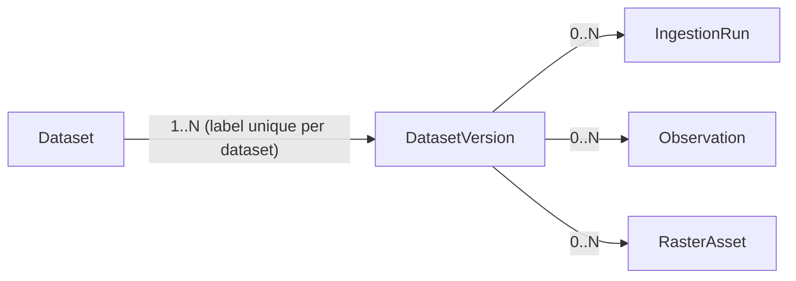

# Ingestion: the dataset catalog and the pipeline

The `ingestion` module records what Yakhnama takes in from other publishers: the
dataset catalog (`Dataset` → `DatasetVersion` → `IngestionRun`), a narrow observation
time series designed to become a TimescaleDB hypertable without an API change, and a
STAC-aligned raster asset catalog. Fields and units are in the
[data dictionary](../data-dictionary/ingestion.md); candidate and implemented sources
are in [`data-sources.md`](data-sources.md). Source code:
`src/yakhnama/modules/ingestion/`. No live network calls are made in this phase — the
only implemented source is a synthetic fixture (`data-sources.md`).

## Catalog model

- **`Dataset`** is the catalog entry: publisher, licence (`DatasetLicence`, always
  required — `DatasetFactory.register` refuses a missing licence with
  `LicenceRequiredError`, and `data/reference/datasets.yaml` cannot describe an entry
  without one either), spatial/temporal coverage, update frequency and status
  (`active → deprecated → retired`, terminal; **proposed** transition table). Never
  deleted.
- **`DatasetVersion`** is one pinned release: a label (`v2.1`, `2024-08-01`), when it
  was retrieved, and the SHA-256 `input_checksum` of the exact input bytes. A
  different file under the same label is a new version, never an overwrite; a version
  has no change methods once recorded.
- **`IngestionRun`** is one execution of the pipeline against one version, through one
  named `SourceAdapter`. `pending → running → succeeded | partially_succeeded |
  failed`, terminal; **a retry is always a new run**, so the record of the first
  attempt is never rewritten.

Lineage reads outward from the leaf: every `Observation` and `RasterAsset` names the
`DatasetVersion` it belongs to (and, for observations, the `IngestionRun` that wrote
it), so "which publisher, which release, which run" is always answerable from the
record itself, never inferred.

## The pipeline: Template Method, seven hooks

`IngestionPipeline.run` (`application/pipeline.py`) is the template; a source
subclasses it and never reorders or skips a stage. In order:

| # | Hook | Default | Abstract? |
|---|------|---------|-----------|
| 1 | `fetch` | Reads the bytes through the `SourceAdapter`. | no |
| 2 | `parse` | — | **yes**: split the payload into source-shaped rows. |
| 3 | `validate` | Normalises the row and applies `ObservationDraft.problems()`. | no |
| 4 | `normalise` | — | **yes**: convert one row to SI units, WGS84, an `ObservationDraft`. |
| 5 | `deduplicate` | Keeps the first record per natural key within the batch. | no |
| 6 | `persist` | Appends through `ObservationRepository.append_many`, batched. | no |
| 7 | `record_lineage` | Finishes the run with its outcome, report, counts and checksum. | no |

Between `fetch` and `parse`, the template checks that the fetched bytes hash to the
version's `input_checksum`: **a checksum mismatch fails the run before anything is
parsed or stored**, because an observation always points at exact, pinned bytes.

**Problems in the data never raise.** Every hook reports what is wrong to the run's
`ValidationCollector` (`reject` for one record, `warn`/`error` for the input as a
whole), which caps what it keeps and derives `RunCounts`
(`fetched = parsed + unparsed`, `valid + invalid ≤ parsed`,
`deduplicated + persisted = valid` once persisted) the same way `IngestionReport`
does, so the collector's numbers and the stored report never disagree. Only a failure
of the *machinery itself* (transport, storage, a broken hook) escapes `run()`; the
handler then rolls the transaction back, asks `failure_report` for the report (which
names the failing stage and, for a `YakhnamaError`, its safe message only — never an
arbitrary exception's text, which may carry a driver message or source data) and marks
the run `failed`.

**Outcome selection** (`select_outcome`, mirrored on the domain's `outcome_problem`):

- **succeeded** — no errors and no invalid records (warnings allowed; a version
  ingested again with nothing new to store is still a success).
- **partially_succeeded** — at least one record persisted, and at least one error or
  invalid record.
- **failed** — errors with nothing persisted, so a failure always says why.

**Deduplication** happens twice, for two different reasons: `deduplicate` (hook 5)
drops repeated natural keys *within one run's batch*, keeping the first record in
source order (a subclass overrides this only when it knows which record a publisher
means to win — that is a source fact, not a pipeline default); `persist` (hook 6) then
calls `ObservationRepository.append_many`, which skips keys already stored by an
**earlier** run or version, so re-ingesting the same release stores nothing twice.

## The observation table: narrow, time-first, no foreign keys

One `Observation` is one value of one variable, at one station or grid cell, at one
instant: `dataset_version_id`, `station` or `grid_cell` (exactly one), `variable`
(a code from the `VARIABLES` registry), `value` (a `Measurement` in the variable's
registry unit, or `null` exactly when `quality` is `missing`, so a publisher's fill
value such as `-9999` is never mistaken for a real reading), `observed_at` (with
precision), `quality` (`good | suspect | missing | estimated`), and `ingested_run_id`.

The **natural key** is `(observed_at, dataset_version_id, variable, site_ref)`, with
`observed_at` **first** on purpose (`docs/data-dictionary/ingestion.md`, `Observation`;
Phase 4 plan §5):

- **Hypertable readiness, checked by structure only.** TimescaleDB requires every
  unique index of a hypertable to include the partitioning column. Because the
  primary key already starts with `observed_at`, a later
  `SELECT create_hypertable('observations', 'observed_at', migrate_data => true)`
  needs no column, key or query changed — nothing in this phase actually runs
  TimescaleDB or proves partitioning behaviour; "hypertable-ready" describes the table
  shape, not a tested conversion.
- **No foreign keys.** `dataset_version_id` and `ingested_run_id` are lineage ids the
  pipeline writes inside the run's own transaction, but the table carries no
  `FOREIGN KEY` constraint to either. This is deliberate, not an oversight: a
  partitioning key must never be blocked from repartitioning by a constraint that
  spans chunks, and the "referenced data is never deleted" rule the rest of the
  system relies on (`AGENTS.md` §2.1, and `docs/open-questions.md` Q162 for the same
  choice elsewhere) stands in for it.
- `site_ref` (`station:<code>` or `grid_cell:<id>`) uses the binary `"C"` collation,
  matching the keyset order the application and its cursors assume.
  `ix_observations_dataset_version_id_variable_code` covers
  `(dataset_version_id, variable_code, observed_at, site_ref)`, the exact order
  `QueryObservations` walks; no separate time index is created, because the primary
  key's own b-tree already serves range scans on `observed_at` (and TimescaleDB adds
  its own once converted).

`GET /api/v1/observations` (`QueryObservationsParameters`: dataset code, variable, a
**half-open** `[from, to)` window, optional site and dataset-version filter, cursor and
limit) is anonymous — run reports and observations are public reads in this phase
(**proposed** default, open question) — and returns one page ordered
`(observed_at, site_ref, dataset_version_id)`.

## STAC alignment for rasters

Raster bytes (for example COGs) never go into PostgreSQL; `RasterAsset` stores
STAC-aligned metadata and an href (an object-storage key or an `http`/`https`/`s3`
URL) per file. `(dataset_version_id, stac_id)` is **unique per dataset version** — the
same `stac_id` may recur across different dataset versions (a re-release of the same
scene id), but never twice within one version — enforced by
`uq_raster_assets_dataset_version_id` (migration `0016`). `footprint` (a WGS84
`Polygon` or `MultiPolygon`) gets an explicit GiST index for bounding-box search, and
the derived `acquired_start` column (the start instant of `acquired_at`'s precision
period) is indexed with `id` for the newest-acquisition-first listing — a column the
domain model does not itself carry, added purely so the database can order by an
instant without recomputing a precision-aware "start of period" rule in SQL on every
query, the same reasoning `events.period_earliest_at` uses
(`docs/data-dictionary/events.md`, "Persistence").

`GET /api/v1/raster-assets` (bbox, acquisition-datetime range, optional dataset code,
cursor and limit) negotiates content the same way `GET /places` does: `?format=geojson`
or `Accept: application/geo+json` returns a GeoJSON `FeatureCollection` of STAC Items
(`RasterAssetSummary.to_stac_item()`), aligned to **STAC 1.1.0** with the **EO
extension v2.0.0** when cloud cover or a band's `common_name` is set
(`docs/data-dictionary/ingestion.md`, "STAC item output", for the full key-by-key
shape); anything else returns the JSON page. `?format=` wins when both are sent, and
every response carries `Vary: Accept`. The GeoJSON form carries its next page only in
the `Link` header, because a `FeatureCollection` has no room for `next_cursor`.

## The reference fixture adapter, and adding a real source

The only implemented source in this phase is
`fixture.temperature_sample`: a synthetic, documented fixture, never real
observations (`data-sources.md`, "Implemented"). `LocalCsvSourceAdapter` (a
`SourceAdapter`) reads a file from the configured fixtures directory through a
`FixturePathResolver` (which refuses path traversal both when the code-to-path mapping
is built and again after symlinks are resolved at read time, and refuses files over
10 MiB); `TemperatureCsvPipeline` (an `IngestionPipeline` subclass) implements `parse`
and `normalise` for its column contract
(`station_code,station_name,longitude,latitude,elevation_m,observed_at,
air_temperature_c,quality`), converting Celsius to Kelvin and mapping its quality
vocabulary to `QualityFlag` (an unrecognised code maps to `suspect` with a warning,
never silently to `good`). Both are registered under the same adapter name,
`local_csv_temperature` (`infrastructure/adapters/reference.py`,
`reference_adapters`/`reference_pipelines`), which is how the composition root finds
the matching pipeline class for a given adapter at run time.

**To add a real source**, follow the `add-source-adapter` skill
(`.claude/skills/add-source-adapter/SKILL.md`) end to end; in outline:

1. Record the publisher's licence, coverage and update frequency as a
   `datasets.yaml` entry (`data/reference/README.md`) with a `source` citation —
   never a guessed licence.
2. Map the publisher's variables to `VARIABLES` (or propose a new variable with its SI
   unit) and its quality vocabulary to `QualityFlag`, documented per dataset like the
   fixture adapter's docstring does.
3. Write a `SourceAdapter` (`httpx`, explicit timeouts, a size cap, retries from the
   composition root — never inside the adapter itself) and an `IngestionPipeline`
   subclass implementing `parse` and `normalise`; register both under the same
   adapter name.
4. Test against a committed fixture of the publisher's real response shape — never a
   live call, in any test.
5. Get a security review of the new outbound integration before it runs against the
   real endpoint.

## The admin routes

Every read under `/api/v1` (datasets, runs, observations, raster assets) is anonymous.
Every write — registering a dataset, recording a version, changing a dataset's status,
requesting a run, cataloguing a raster — lives under `/api/v1/admin` and requires
`IsAdmin` (`catalog_policy`).

| Method | Path | Auth | Notes |
|--------|------|------|-------|
| `GET` | `/api/v1/datasets` | anon | Cursor pagination; optional status filter. |
| `GET` | `/api/v1/datasets/{code}` | anon | `ETag`; most recent versions inline. |
| `GET` | `/api/v1/datasets/{code}/runs` | anon | Newest first; who requested a run is never shown. |
| `GET` | `/api/v1/ingestion-runs/{run_id}` | anon | The run's full report; who requested it is never shown. |
| `GET` | `/api/v1/observations` | anon | Half-open `[from, to)` window; cursor pagination. |
| `GET` | `/api/v1/raster-assets` | anon | Bbox/datetime filters; GeoJSON/STAC negotiation. |
| `POST` | `/api/v1/admin/datasets` | auth (policy) | `IsAdmin`; licence required; `201`, `Location`, `ETag`. |
| `POST` | `/api/v1/admin/datasets/{code}/versions` | auth (policy) | `IsAdmin`; dataset must be `active`; `201`. |
| `POST` | `/api/v1/admin/datasets/{code}/status` | auth (policy) | `IsAdmin`; deprecate or retire; `If-Match` optional. |
| `POST` | `/api/v1/admin/datasets/{code}/runs` | auth (policy) | `IsAdmin`; names the version and adapter; `202`; a worker executes `ingestion.run`. |
| `POST` | `/api/v1/admin/raster-assets` | auth (policy) | `IsAdmin`; catalogues one STAC-aligned item; `201`. |

There is no dedicated `ListDatasetVersions` read route yet — versions are only ever
read inline on `GET /datasets/{code}` (open question).

## The seed step

`data/reference/datasets.yaml` is loaded the same way the Phase 1 reference files are
(`data/reference/README.md`): `schema_version: 1`, at most 1000 entries, unique codes,
never removed. Each entry needs a licence (`{spdx_id | custom_text, url,
attribution}`), and carries `is_fixture` (`true` for synthetic test data such as
`fixture.temperature_sample`, so it is never mistaken for a real publisher's dataset)
and `source` (a citation of the publisher's documentation, or `synthetic fixture`).
`poetry run poe seed` loads it the same way it loads hazard types, impact metrics and
places; the ingestion catalog seed is idempotent by `code`, like the other three.

## Further reading

- `docs/data-dictionary/ingestion.md` — every field, unit, the run outcome table and
  the persistence columns of `datasets`, `dataset_versions`, `ingestion_runs`,
  `observations` and `raster_assets`.
- `docs/architecture/data-sources.md` — the implemented fixture source and every
  candidate source, documented but not implemented.
- `docs/architecture/exchange.md` — the companion module for data going *out*
  (exports) and historical backfill coming *in* (imports), as opposed to ongoing
  external ingestion.
- `docs/architecture/api.md` — the `/api/v1` conventions this module follows
  unchanged (Problem Details, pagination, `ETag`/`If-Match`, rate limiting).
- `docs/open-questions.md` — the Phase 4 open questions this page and the data
  dictionary reference.
