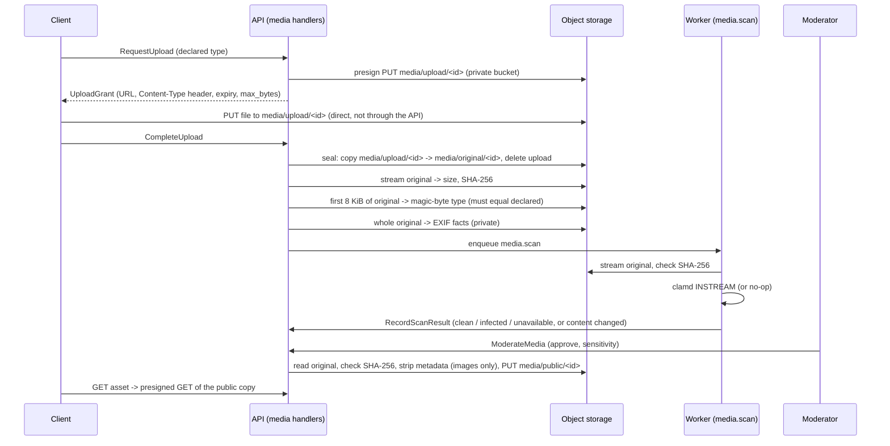

# Media storage, EXIF and malware scanning

## Purpose

How an uploaded photo, video or document travels from a phone to a public link, what
the platform stores where, what it strips, and what it cannot yet guarantee. The rules
behind it are in [ADR 0009](../adr/0009-object-storage-for-media-and-rasters.md); the
fields are in the [media data dictionary](../data-dictionary/media.md). This page
describes the adapters in `src/yakhnama/modules/media/infrastructure/adapters/`. See
[`recording.md`](recording.md) for where an upload sits in the wider report-to-event
flow, and [`api.md`](api.md), "Media visibility", for what an anonymous or
non-owning caller may read back.

## Routes

`POST /api/v1/media` (before the report exists) or
`POST /api/v1/reports/{report_id}/media` (for the caller's own submitted report)
grant the presigned upload; `POST /api/v1/media/{asset_id}/complete` confirms it;
`GET /api/v1/media/{asset_id}` reads it back, an anonymous or non-owning caller
seeing only a published asset's public copy; `POST
/api/v1/moderation/media/{asset_id}/decision` (`CanModerate`) records the
moderator's decision. Full route table, auth and notes: [`api.md`](api.md#route-table-phase-3).

## Upload flow

1. **Presigned PUT.** `S3StoragePort.presign_put` signs a `PUT` into the private bucket
   for the **upload key** `media/upload/<id>` only (it refuses any other key). The URL
   is bound to the declared `Content-Type`; a request with any other type is refused
   by storage (403).
2. **Complete and seal.** A presigned `PUT` stays valid until it expires, and S3
   overwrites, so the upload key can be replaced after completion. `seal_upload`
   therefore copies it server-side to the original key `media/original/<id>`, which
   no client URL ever covers, pinned to the `ETag` seen by `HEAD`, and deletes the
   upload key. It then computes the original's SHA-256 by streaming it (an S3 `ETag`
   is an MD5, not a SHA-256). `FiletypeMimeSniffer` reads the first 8 KiB of the
   original, and the detected type must equal the declared one (`mime_mismatch`
   otherwise). `PillowExifReader` reads the whole original and returns the capture
   time, GPS position and camera. Every later read (scan, EXIF, publication, owner
   downloads) uses the original.
3. **Scan.** The `media.scan` task passes the recorded SHA-256 to the
   `MalwareScanner`. `ClamAvScanner` streams through `iter_original`, which hashes
   the bytes. If they do not match, the task records `is_content_changed`: the scan
   becomes `unavailable` and the asset is quarantined.
4. **Moderate and publish.** Once an asset is clean, approved, not blocked by its
   sensitivity and of a publishable type, `copy_stripped_public` checks the original
   against the recorded SHA-256 and writes the public copy. On a mismatch nothing is
   written, the asset is quarantined and `MediaContentChangedError` (409,
   `details.reason` = `media_content_changed`) is raised.
5. **Download.** `presign_get` signs a `GET` in whichever bucket holds the key
   (`media/public/...` in the public bucket, anything else in the private one).

## Buckets and keys

| Bucket (setting) | Development name | Holds | Who reads it |
|------------------|------------------|-------|--------------|
| `storage_private_bucket` | `yakhnama-media-private` | Unchanged originals, EXIF included | Owner and moderators, through short-lived presigned links |
| `storage_public_bucket` | `yakhnama-media-public` | Metadata-stripped copies | Anyone given a presigned link |
| (not used yet) | `yakhnama-rasters` | Rasters (COG, later phase) | — |

Keys are `media/upload/<asset id>`, `media/original/<asset id>` and
`media/public/<asset id>` (Q-M6), built by the platform and never from a file name.
Only upload keys are ever presigned for writing. The adapter re-validates every key,
refuses to write a public copy outside `media/public/`, and seals only from an upload
key to an original key. The two bucket settings must differ; the
settings refuse one bucket for both.

## Metadata policy

| Format | Public copy | What is removed |
|--------|-------------|-----------------|
| JPEG, PNG, WebP | Decoded and re-encoded from pixels alone (JPEG and WebP at quality 95; PNG lossless). Animated PNG and WebP keep their frames and timing. | EXIF (GPS, time, camera, serial numbers), XMP, IPTC, ICC profiles, PNG text chunks. The EXIF orientation is applied to the pixels first, so the copy displays upright. Palette images become RGBA so transparency survives. |
| PDF, MP4 | **Never published.** The domain keeps them unpublishable (`PUBLISHABLE_MIME_TYPES`), and `strip_metadata` refuses them (`reason: unsupported`). | Not applicable: a PDF's document information or an MP4's `udta` box may hold an author or a position, and no stripper exists yet (Q-M13). |

**Decompression bombs.** `image_limits` sets `Image.MAX_IMAGE_PIXELS` explicitly and
checks the declared canvas (50 MP per frame), the frame count (200) and the total
pixels (100 MP) before any pixel is decoded. Anything above is refused
(`reason: too_large`), including the band where Pillow itself would only warn.
Pillow's hard error, above twice the limit, is refused as `malformed`. The warning
filter is not changed process-wide, because filters are global and not thread-safe
and stripping runs in a worker thread. All three limits are **proposed** (Q-M19).

The original always keeps its EXIF as evidence; the facts read from it are private
(`ExifFacts`) and are never logged or published.

EXIF parsing never raises: each fact is read on its own, and a malformed one is dropped
while the others are kept. A capture time without `OffsetTimeOriginal` is assumed to be
UTC (**proposed**, Q-M11).

## Malware scanners

| `malware_scanner` | Adapter | Verdict | Status |
|-------------------|---------|---------|--------|
| `noop` (default) | `NoOpMalwareScanner` | `unavailable` (nothing is publishable); may be built with `clean` for a local publication walkthrough | Development and tests only. Logs `malware_scanner_disabled` when built; the production guard refuses it. |
| `clamav` | `ClamAvScanner` over `tcp_connector(clamav_host, clamav_port)` | `clean`, `infected`, or `unavailable` on a connection error, timeout or error reply | **Unverified against a real clamd** (Q-M12). The `INSTREAM` framing is unit tested against a fake stream, and against a loopback stand-in server in the integration tests. |

clamd's `StreamMaxLength` defaults to 25 MB, below the 50 MiB upload cap. Operators must
raise it to at least `50M`, or larger files get `unavailable`, not `clean`.

## Limits and costs

- **Size.** 50 MiB (`MAX_MEDIA_BYTES`, Q-M2). S3 cannot cap a presigned `PUT`, so the cap
  is a client contract checked on completion: `head` reports the real size without
  downloading an oversize object, and `CompleteUploadHandler` rejects it. Such an object
  gets the placeholder digest `OVERSIZE_SHA256` (Q-M14) and stays in the private bucket
  until a clean-up job exists.
- **Reads per upload.** One server-side copy to seal, one full read to hash, one full read for EXIF, one 8 KiB range
  read, one full read to scan, and one full read and write to publish. Each full read is
  capped at 50 MiB in memory. Re-encoding runs in a worker thread so it does not block
  the event loop.
- **Connections.** Each operation opens a short-lived `aiobotocore` client: a 5 s connect
  timeout, a 30 s read timeout and 3 attempts in standard retry mode. Path-style
  addressing is used for MinIO compatibility (Q-M15).
- **Presigned links** live `storage_presign_ttl_seconds` (default 900, range 60–3600,
  **proposed**, Q-M17).
- **Secrets.** `storage_secret_access_key` is a `SecretStr`, and the access key id is
  excluded from `repr`. Errors name the failed operation and the exception class, never
  the key, bucket, URL or credentials.

## Configuration

`YAKHNAMA_STORAGE_ENDPOINT_URL`, `_STORAGE_REGION`, `_STORAGE_ACCESS_KEY_ID`,
`_STORAGE_SECRET_ACCESS_KEY`, `_STORAGE_PRIVATE_BUCKET`, `_STORAGE_PUBLIC_BUCKET`,
`_STORAGE_PRESIGN_TTL_SECONDS`, `_MALWARE_SCANNER`, `_CLAMAV_HOST`, `_CLAMAV_PORT`,
`_CLAMAV_TIMEOUT_SECONDS`; see `.env.example`. In production the settings refuse the
`noop` scanner, the development storage secret and a non-`https` endpoint.

## Open questions

| Id | Question | Proposed default | Blocking |
|----|----------|------------------|----------|
| Q-M9 | What should the development scanner report? | `unavailable` by default; `clean` only when a developer builds it that way; `noop` refused in production. | no (resolved by the adapter, pending confirmation) |
| Q-M11 | Which time zone does a zone-less EXIF `DateTimeOriginal` use, and should an unknown zone lower its precision below `exact`? | Assume UTC, keep `exact`. Pakistan Standard Time (UTC+5) is likelier for local phones. | no |
| Q-M12 | Which production scanner is used, and is `ClamAvScanner` verified against a real clamd? | ClamAV over TCP; verify against `clamav/clamav` before production. | yes, before production |
| Q-M13 | How are PDF and MP4 metadata stripped so they can be published? | Until a stripper exists, PDF and MP4 are never published (domain rule and adapter refusal). Candidates: `pikepdf` for PDF, remuxing without `udta` for MP4. | no for safety (they stay private); yes before video and document publication |
| Q-M14 | `StoredObject.sha256` cannot express "not computed" for an oversize object. | A placeholder digest of 64 zeros; make the field optional in the DTO. | no |
| Q-M15 | Path-style or virtual-hosted S3 addressing in production. | Path-style (works with MinIO and AWS). | no |
| Q-M16 | Presigned URLs carry the endpoint the API uses; behind a private network, clients need a public host. | One endpoint for now; add a separate public presign endpoint when deploying. | no |
| Q-M17 | Presigned URL lifetime. | 15 minutes. | no |
| Q-M18 | Is quality-95 re-encoding and dropping ICC profiles acceptable for the public copy? | Yes; the original keeps full fidelity. | no |
| Q-M19 | Image decoding limits. | 50 MP per frame, 200 frames, 100 MP in total (about 400 MB as RGBA). A 108 or 200 MP phone photo stays private: its public copy is refused. | no |
| Q-M20 | Orphaned upload keys. A still-valid presigned URL can recreate `media/upload/<id>` after sealing, and abandoned uploads are never completed. | A bucket lifecycle rule that expires `media/upload/` objects after one day. | no |
