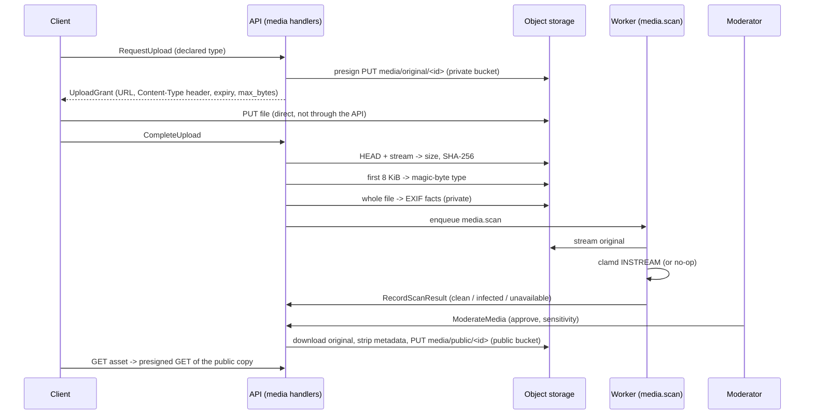

# Media storage, EXIF and malware scanning

## Purpose

How an uploaded photo, video or document travels from a phone to a public link, what
the platform stores where, what it strips, and what it cannot yet guarantee. The rules
behind it are in [ADR 0009](../adr/0009-object-storage-for-media-and-rasters.md); the
fields are in the [media data dictionary](../data-dictionary/media.md). This page
describes the adapters in `src/yakhnama/modules/media/infrastructure/adapters/`. See
[`recording.md`](recording.md) for where an upload sits in the wider report-to-event
flow, and [`api.md`](api.md), "Media visibility", for what an anonymous or
non-owning caller may read back.

## Routes

`POST /api/v1/media` (before the report exists) or
`POST /api/v1/reports/{report_id}/media` (for the caller's own submitted report)
grant the presigned upload; `POST /api/v1/media/{asset_id}/complete` confirms it;
`GET /api/v1/media/{asset_id}` reads it back, an anonymous or non-owning caller
seeing only a published asset's public copy; `POST
/api/v1/moderation/media/{asset_id}/decision` (`CanModerate`) records the
moderator's decision. Full route table, auth and notes: [`api.md`](api.md#route-table-phase-3).

## Upload flow

1. **Presigned PUT.** `S3StoragePort.presign_put` signs a `PUT` into the private bucket
   that is bound to the declared `Content-Type`; a request with any other type is
   refused by storage (403).
2. **Complete.** `head` measures the stored object and computes its SHA-256 by
   streaming it (an S3 `ETag` is an MD5, not a SHA-256). The read is pinned to the
   `ETag` seen by `HEAD`, so a file replaced in between fails instead of being hashed
   as the wrong one. `FiletypeMimeSniffer` reads the first 8 KiB; `PillowExifReader`
   reads the whole file and returns the capture time, GPS position and camera.
3. **Scan.** The `media.scan` task calls a `MalwareScanner` and records its verdict.
4. **Moderate and publish.** Once an asset is clean, approved and not blocked by its
   sensitivity, `copy_stripped_public` writes the public copy.
5. **Download.** `presign_get` signs a `GET` in whichever bucket holds the key
   (`media/public/...` in the public bucket, anything else in the private one).

## Buckets and keys

| Bucket (setting) | Development name | Holds | Who reads it |
|------------------|------------------|-------|--------------|
| `storage_private_bucket` | `yakhnama-media-private` | Unchanged originals, EXIF included | Owner and moderators, through short-lived presigned links |
| `storage_public_bucket` | `yakhnama-media-public` | Metadata-stripped copies | Anyone given a presigned link |
| (not used yet) | `yakhnama-rasters` | Rasters (COG, later phase) | — |

Keys are `media/original/<asset id>` and `media/public/<asset id>` (Q-M6), built by the
platform and never from a file name. The adapter re-validates every key and refuses to
write a public copy outside `media/public/`. The two bucket settings must differ; the
settings refuse one bucket for both.

## Metadata policy

| Format | Public copy | What is removed |
|--------|-------------|-----------------|
| JPEG, PNG, WebP | Decoded and re-encoded from pixels alone (JPEG and WebP at quality 95; PNG lossless). Animated PNG and WebP keep their frames and timing. | EXIF (GPS, time, camera, serial numbers), XMP, IPTC, ICC profiles, PNG text chunks. The EXIF orientation is applied to the pixels first, so the copy displays upright. Palette images become RGBA so transparency survives. |
| PDF, MP4 | Copied byte for byte. | **Nothing.** A PDF's document information or an MP4's `udta` box may still hold an author or a position (Q-M13). |

The original always keeps its EXIF as evidence; the facts read from it are private
(`ExifFacts`) and are never logged or published.

EXIF parsing never raises: each fact is read on its own, and a malformed one is dropped
while the others are kept. A capture time without `OffsetTimeOriginal` is assumed to be
UTC (**proposed**, Q-M11).

## Malware scanners

| `malware_scanner` | Adapter | Verdict | Status |
|-------------------|---------|---------|--------|
| `noop` (default) | `NoOpMalwareScanner` | `unavailable` (nothing is publishable); may be built with `clean` for a local publication walkthrough | Development and tests only. Logs `malware_scanner_disabled` when built; the production guard refuses it. |
| `clamav` | `ClamAvScanner` over `tcp_connector(clamav_host, clamav_port)` | `clean`, `infected`, or `unavailable` on a connection error, timeout or error reply | **Unverified against a real clamd** (Q-M12). The `INSTREAM` framing is unit tested against a fake stream, and against a loopback stand-in server in the integration tests. |

clamd's `StreamMaxLength` defaults to 25 MB, below the 50 MiB upload cap. Operators must
raise it to at least `50M`, or larger files get `unavailable`, not `clean`.

## Limits and costs

- **Size.** 50 MiB (`MAX_MEDIA_BYTES`, Q-M2). S3 cannot cap a presigned `PUT`, so the cap
  is a client contract checked on completion: `head` reports the real size without
  downloading an oversize object, and `CompleteUploadHandler` rejects it. Such an object
  gets the placeholder digest `OVERSIZE_SHA256` (Q-M14) and stays in the private bucket
  until a clean-up job exists.
- **Reads per upload.** One full read to hash, one full read for EXIF, one 8 KiB range
  read, one full read to scan, and one full read and write to publish. Each full read is
  capped at 50 MiB in memory. Re-encoding runs in a worker thread so it does not block
  the event loop.
- **Connections.** Each operation opens a short-lived `aiobotocore` client: a 5 s connect
  timeout, a 30 s read timeout and 3 attempts in standard retry mode. Path-style
  addressing is used for MinIO compatibility (Q-M15).
- **Presigned links** live `storage_presign_ttl_seconds` (default 900, range 60–3600,
  **proposed**, Q-M17).
- **Secrets.** `storage_secret_access_key` is a `SecretStr`, and the access key id is
  excluded from `repr`. Errors name the failed operation and the exception class, never
  the key, bucket, URL or credentials.

## Configuration

`YAKHNAMA_STORAGE_ENDPOINT_URL`, `_STORAGE_REGION`, `_STORAGE_ACCESS_KEY_ID`,
`_STORAGE_SECRET_ACCESS_KEY`, `_STORAGE_PRIVATE_BUCKET`, `_STORAGE_PUBLIC_BUCKET`,
`_STORAGE_PRESIGN_TTL_SECONDS`, `_MALWARE_SCANNER`, `_CLAMAV_HOST`, `_CLAMAV_PORT`,
`_CLAMAV_TIMEOUT_SECONDS`; see `.env.example`. In production the settings refuse the
`noop` scanner, the development storage secret and a non-`https` endpoint.

## Open questions

| Id | Question | Proposed default | Blocking |
|----|----------|------------------|----------|
| Q-M9 | What should the development scanner report? | `unavailable` by default; `clean` only when a developer builds it that way; `noop` refused in production. | no (resolved by the adapter, pending confirmation) |
| Q-M11 | Which time zone does a zone-less EXIF `DateTimeOriginal` use, and should an unknown zone lower its precision below `exact`? | Assume UTC, keep `exact`. Pakistan Standard Time (UTC+5) is likelier for local phones. | no |
| Q-M12 | Which production scanner is used, and is `ClamAvScanner` verified against a real clamd? | ClamAV over TCP; verify against `clamav/clamav` before production. | yes, before production |
| Q-M13 | Must PDF and MP4 metadata be stripped before publication? | Not stripped now; documented. Candidates: `pikepdf` for PDF, remuxing without `udta` for MP4. | yes, before public media launch |
| Q-M14 | `StoredObject.sha256` cannot express "not computed" for an oversize object. | A placeholder digest of 64 zeros; make the field optional in the DTO. | no |
| Q-M15 | Path-style or virtual-hosted S3 addressing in production. | Path-style (works with MinIO and AWS). | no |
| Q-M16 | Presigned URLs carry the endpoint the API uses; behind a private network, clients need a public host. | One endpoint for now; add a separate public presign endpoint when deploying. | no |
| Q-M17 | Presigned URL lifetime. | 15 minutes. | no |
| Q-M18 | Is quality-95 re-encoding and dropping ICC profiles acceptable for the public copy? | Yes; the original keeps full fidelity. | no |
