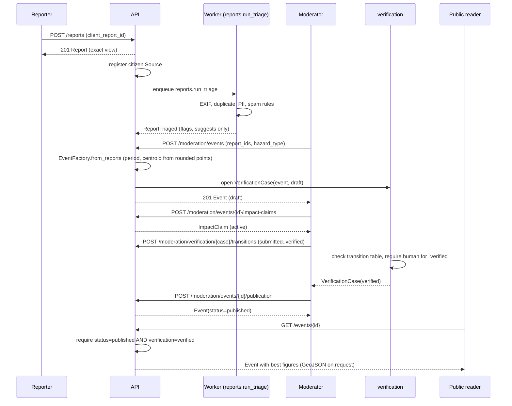

# Recording flow: reports to public events

## Purpose

How one hazard observation travels from a citizen's phone to a verified, publicly
readable `Event` with a best figure: report submission and triage, media upload and
moderation, event creation and linking, impact claims, the verification state
machine as implemented, and the audit trail. This page is the companion to the seven
Phase 3 data dictionaries (`reports`, `media`, `events`, `verification`, `impacts`,
`provenance`, `audit`) and to [`api.md`](api.md) for the route table. Where this page
and the code disagree, the code and its tests are binding; report the mismatch.

Phase 3 plan: `docs/plans/phase-3.md`.

## End to end

1. **Submit.** An authenticated citizen or organisation member calls
   `POST /api/v1/reports` with a client-generated `client_report_id` (a UUIDv7), the
   observation (point, accuracy, observed time and precision), a description, a
   hazard-type guess and an optional place hint. `SubmitReport` is idempotent on
   `client_report_id`: a retried submission with the same id returns the stored
   report again, `201` with the identical body, because the handler cannot tell a
   retry from the first call. The platform also registers a `citizen` (or
   `organisation`) `Source` for the report at submission.
2. **Media (optional, any time before or after submission).** The reporter requests
   a presigned upload (`POST /media` before the report exists, or
   `POST /reports/{id}/media` for their own submitted report), `PUT`s the file
   straight to object storage, then calls `POST /media/{id}/complete`. The `media`
   module streams the stored object to size it, hash it (SHA-256), sniff its magic
   bytes and read its EXIF, then enqueues `media.scan`. See
   [`media.md`](media.md) for the adapters and
   [`../data-dictionary/media.md`](../data-dictionary/media.md) for the fields.
   Because upload can happen either side of submission, a report's `media_ids` may
   be attached after the report itself was submitted (open question, see below).
3. **Triage (system task, suggests only).** `reports.run_triage` runs the Chain of
   Responsibility over the submitted report: EXIF plausibility, duplicate
   suspicion, a PII scrub of the description, and a spam check. It attaches a
   `TriageResult` with zero or more `TriageFlag`s to the report and never changes
   its status, blocks it or edits it. See
   [`../data-dictionary/reports.md`](../data-dictionary/reports.md), "Triage", for
   every rule and threshold. Triage has no actor (a system task); if the broker
   never delivers the task, nothing re-triggers it in Phase 3 (open question below).
4. **Moderator creates an event.** A moderator calls
   `POST /api/v1/moderation/events` with one or more report ids and a hazard type.
   `EventFactory.from_reports` derives the event's period (earliest to latest
   `observed_at`, at the coarsest precision among the reports) and centroid (the
   mean of the reports' **public, rounded** points — never the reporters' exact
   GPS) and opens the event's `VerificationCase` in `draft`. The event cites every
   linked report's source. See
   [`../data-dictionary/events.md`](../data-dictionary/events.md), "Factory
   derivations".
5. **Moderator links more reports, sets geometry/period/attributes, adds affected
   places.** Each is its own command (`LinkReportToEvent`, `SetEventGeometry`,
   `SetEventPeriod`, `SetEventAttributes`, `AddAffectedPlace`); `PATCH
   /moderation/events/{id}` runs one command per member sent in the body, so a
   failure part-way through leaves the members before it applied (open question,
   see below).
6. **Moderator records impact claims and damage.** `POST
   /moderation/events/{id}/impact-claims` records one metric value from one source
   with one confidence level; `POST /moderation/infrastructure-assets` registers an
   asset first if needed; `POST
   /moderation/events/{id}/damage-records` records damage to it. Claims and damage
   are append-only: a correction records a new claim/record and retracts the old
   one in the same unit of work. The **best figure** per metric is a derived read
   model, recomputed from the active claims on every read — see
   [`best-figure.md`](best-figure.md) for the full policy, worked examples and its
   own open questions.
7. **Verification.** Every report, event and claim has exactly one
   `VerificationCase` (reports and claims open in `submitted`, events in `draft`;
   see [`../data-dictionary/verification.md`](../data-dictionary/verification.md)
   for the full transition table). A moderator moves a case through
   `POST /moderation/verification/{case_id}/transitions`; only a human reaches
   `verified` (`is_human=True` is always sent by the API, because a person makes
   every move through it). Publishing an event (`POST
   /moderation/events/{id}/publication`) only sets its own `status` to
   `published`; the aggregate does not itself require a `verified` case first — see
   "Publishing requires verification?" in `events.md`'s open questions.
8. **Public reads.** `GET /api/v1/events`, `/events/{id}` and
   `/events/{id}/timeline` are anonymous. Anyone but a moderator only ever sees
   events that are both `published` **and** `verified`
   (`EventRecordQueryService` narrows the search and reports anything else as
   missing, the same "not found, not forbidden" rule reports and media use).
   `GET /events/{id}/impacts` follows the event's own visibility. `GET
   /media/{id}` shows an anonymous or non-owning caller only a published asset's
   EXIF-stripped public copy.
9. **Audit.** Every domain event from every Phase 3 module is recorded, after
   commit, by an outbox subscriber that writes one append-only `AuditEntry`: actor,
   action (the event's `event_type`), target, before/after state **digests** only
   (SHA-256, never free text) and the request id. See "Audit via the outbox" below
   and [`../data-dictionary/audit.md`](../data-dictionary/audit.md).

## Reporter privacy rules

- **Exact position is private.** `Report.observation.coordinates` is stored exact
  and never leaves the system unrounded except to the reporter themselves and to
  moderators (`exact_view_policy`: `IsSelf(reporter) | CanModerate()`).
- **Public payloads are rounded.** Every other view rounds the position to
  `Settings.public_coordinate_decimals` (default 2 decimal places, about 0.72 km
  maximum displacement in Gilgit-Baltistan — see
  `shared_kernel/privacy.py`'s `PublicCoordinatePolicy` and `round_coordinates` for
  the exact rule and its bound). The same policy rounds the reporter points an
  `Event`'s centroid is derived from (step 4 above), so an event's location is
  never back-computable to a reporter's exact position from the public API either.
- **Accuracy is hidden outside the exact view.** `observation.accuracy` (the
  device's GPS accuracy radius) is shown only to the reporter and moderators; a
  rounded view omits it entirely, not just the position (`rounded_view_policy`,
  `ReportDetail.from_record`).
- **Organisation colleagues see the rounded view.** A report submitted for an
  organisation is visible, rounded, accuracy hidden, to every member of that
  organisation (`IsMemberOf(organization_id)`); nobody else sees a report that
  is not theirs or their organisation's, other than a moderator.
- **Triage flags are moderator-only.** `TriageResult` (including a PII-scrub flag)
  is visible only to moderators; a flag's own `detail` text never repeats the
  personal data it names (`docs/data-dictionary/reports.md`, "Personal data").
- **A place is never created from a reporter's location.** Only a moderator's
  chosen `affected_places` and geometry become part of the public record; the
  Phase 3 plan (§2, carried from the Phase 2 security review) forbids ever
  deriving a `Place` from where a reporter stood.
- **Media EXIF location is never published.** Read in full from the private
  original for triage and moderation, it is stripped entirely from the public
  copy and never appears in an event, a log or an API response
  (`../data-dictionary/media.md`, "Personal data").

## The gate flow

## Task names and schedules

Every task runs behind the `TaskQueue` port (ADR 0008; Taskiq with a Redis broker in
production, an in-memory fake in tests), bound in `platform/container.py` and
processed by `poetry run poe worker`. Periodic tasks are enqueued by exactly one
`poetry run poe scheduler` process per deployment (running two would double-enqueue
every periodic task; each is idempotent, so this is safe but wasteful).

| Task name | Trigger | Schedule | Payload |
|-----------|---------|----------|---------|
| `reports.run_triage` | Enqueued by `SubmitReport`/`ReviseReport` | On submission | `report_id` |
| `media.scan` | Enqueued by `CompleteUpload` | On upload completion | `asset_id` |
| `outbox.relay_once` | Periodic | Every `outbox_relay_interval_seconds` (default 5 s) | none |
| `outbox.purge_published` | Periodic | Every 24 h | none |
| `idempotency.purge_expired` | Periodic | Every `idempotency_purge_interval_minutes` (default 60 min) | none |

Source: `src/yakhnama/platform/tasks/handlers.py` (`TASK_NAMES`) and
`src/yakhnama/platform/tasks/scheduled.py` (`task_schedules`). Every handler must be
idempotent (delivery is at least once), raises rather than swallows a failure (the
broker does not retry; the outbox relay is what retries durable work), and is short
enough to finish before the broker's redelivery idle time.

## Outbox: lease, dead-letter and retention

`OutboxRelay.relay_once` (`platform/outbox/relay.py`), enqueued as
`outbox.relay_once`:

- **Lease-based claiming.** One short transaction claims a batch with
  `SELECT ... FOR UPDATE SKIP LOCKED`, sets `leased_until = now + lease` (default
  120 s) and increments `attempts`, then commits before any subscriber runs. Two
  relays never deliver the same message while both are healthy; a crashed relay's
  leases simply lapse and the rows are claimed again.
- **At-least-once delivery.** A message is marked published only once every
  subscriber for its `event_type` returns without raising. Every subscriber —
  including the audit subscriber — must therefore be idempotent, keyed by
  `OutboxEnvelope.event_id`.
- **Timeouts.** Each subscriber call is cancelled after
  `subscriber_timeout_seconds` (default 30 s) and counts as a failure.
- **Retries and dead-letter.** A failure records `last_error` (the subscriber name
  and the exception type only, never the message or the payload) and releases the
  lease for a retry on the next run. After the `max_attempts`-th failed attempt
  (default 5), the row is marked `dead_lettered_at` and logged
  (`outbox_dead_lettered`, identifiers only); it is not claimed again until an
  operator clears the column. There is no back-off yet between retries (open
  question below).
- **Order.** Rows are claimed oldest `created_at` first; a failed message is
  retried on a later run while newer messages continue, so there is no strict
  per-aggregate ordering.
- **Retention.** `outbox.purge_published` deletes published rows older than
  `outbox_retention_days`; pending and dead-lettered rows are always kept.

## Audit via the outbox subscriber

The `audit` module subscribes to every Phase 3 module's domain events (it emits
none of its own, so it cannot recurse into itself). For each delivered event it
writes one `AuditEntry`: `event_id` (for redelivery de-duplication), `occurred_at`
(the event's own timestamp, not the relay's), `actor_id` (`null` for a system task),
`action` (the `event_type`), `target` (`aggregate_type` + `aggregate_id`), and
`before_digest`/`after_digest` — SHA-256 digests of the aggregate's canonical JSON
state, computed by the writer, never the state itself. See
[`../data-dictionary/audit.md`](../data-dictionary/audit.md) for the exact digest
algorithm and the canonical-JSON rules. Because the audit log carries no free text,
the audit trail can prove *that* something changed and roughly *what kind* of change
it was, but reconstructing the actual before/after values needs the event itself
(the outbox row, while it exists) or the aggregate's own history.

## Per-module reference

| Concern | Page |
|---------|------|
| `Source` fields, licensing, immutability once referenced | [`../data-dictionary/provenance.md`](../data-dictionary/provenance.md) |
| `AuditEntry` fields, digest algorithm, canonical JSON | [`../data-dictionary/audit.md`](../data-dictionary/audit.md) |
| `Report` fields, revisions, triage rules and thresholds | [`../data-dictionary/reports.md`](../data-dictionary/reports.md) |
| `MediaAsset` fields, EXIF, deduplication, scanning | [`../data-dictionary/media.md`](../data-dictionary/media.md) and [`media.md`](media.md) |
| `Event` fields, lifecycle, graph, search specifications | [`../data-dictionary/events.md`](../data-dictionary/events.md) |
| `VerificationCase` states and the transition table | [`../data-dictionary/verification.md`](../data-dictionary/verification.md) |
| `ImpactClaim`, `InfrastructureAsset`, `DamageRecord`, the best figure | [`../data-dictionary/impacts.md`](../data-dictionary/impacts.md) and [`best-figure.md`](best-figure.md) |
| Route table, auth per route, GeoJSON, idempotency | [`api.md`](api.md) |

## Open questions raised in this phase

Recorded in full, with proposed defaults and blocking status, in
`docs/open-questions.md` (Q77 onward). Summarised here for orientation:

- What happens to triage if the broker never delivers `reports.run_triage`
  (proposed: a periodic re-enqueue of untriaged reports).
- Clean-up of orphaned source registrations and duplicate original media objects
  (proposed: a clean-up job).
- System tasks (triage, scanning) have no actor, by design.
- Media may be attached to a report after it was submitted.
- A report's hazard-type guess and place hint are not checked for existence
  against the `hazards`/`geography` modules.
- Cross-module application calls are not atomic; the proposed mitigation is
  idempotent calls rather than a saga.
- Public visibility of an event requires both `published` and `verified`.
- `EventFactory.from_reports` has no `summary` parameter.
- Claims and damage records have no `VerificationCase` yet in Phase 3.
- Events and verification commands carry no `expected_version`, so `If-Match` on
  their routes only narrows, and does not close, a concurrency race.
- `PATCH /moderation/events/{id}` runs one command per changed member, so a
  partial failure is possible.
- There is no read route for individual claims or damage records outside
  `GET /events/{id}/impacts`.
- Several media, safe-text and outbox operational defaults carried over from
  earlier phases (ClamAV unverified, PDF/MP4 metadata not stripped, no back-off
  on outbox retries, and others) — see `docs/open-questions.md`, Q77 onward, for
  the complete, exact list.

See `docs/open-questions.md` directly for the authoritative, numbered list; this
page never duplicates the blocking status or the proposed default, to avoid the two
drifting apart.
